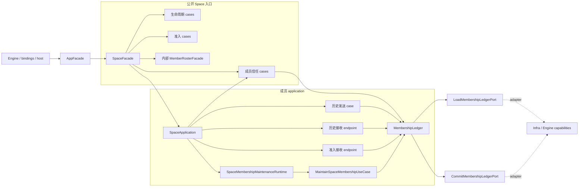
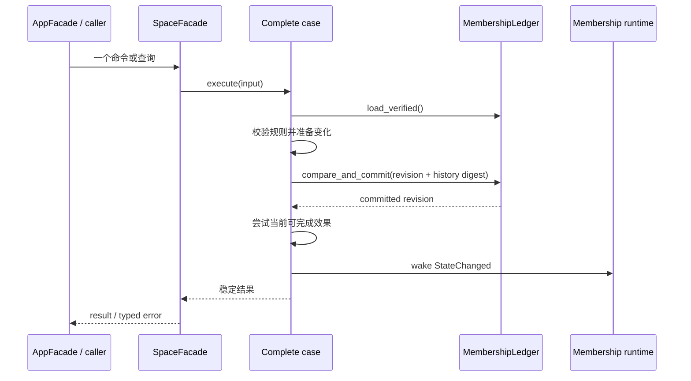
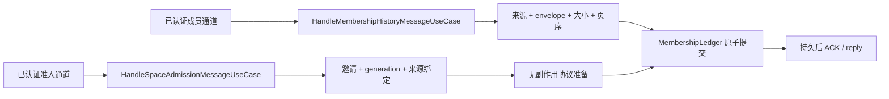
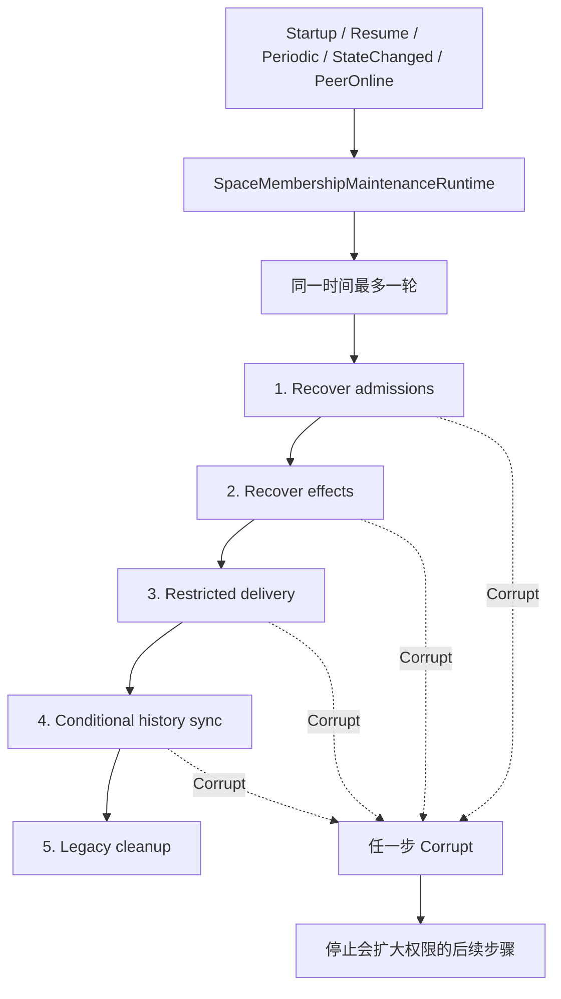
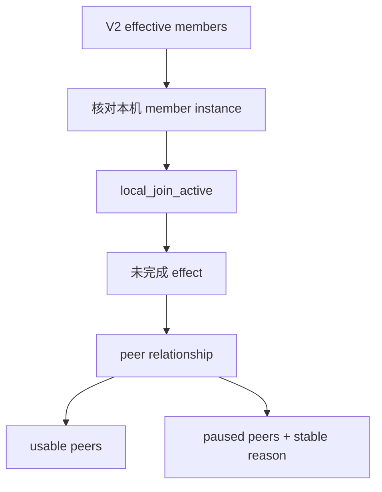

# Space Application 设计与代码地图

本文说明 `crates/uc-application/src/space/` 的当前结构。它面向维护者和 Agent，目标是让修改者先找到完整业务入口、事实负责人和恢复路径，再动代码。

本文描述的是 **application 当前实现**。Core 规则、Infra adapter、Engine 组装和绑定是否已完成接入，必须在各自仓库位置单独验证，不能从本文推断。

## 先记住的规则

1. `SpaceFacade` 是 application 唯一公开的 Space 业务入口。不要新增第二个 Space facade，也不要公开内部 use case、runtime 或 ledger。
2. `space/mod.rs` 是唯一模块出口。子模块一律私有；Space 之外只允许使用 `crate::space::{...}`，不得穿透子目录。Space 内跨责任区协作也只能经过 `admission`、`lifecycle`、`membership` 或 `connectivity` 的根出口。
3. 一个业务动作只由一个完整 case 负责。调用方只提交必要输入并接收稳定结果，不编排内部步骤。
4. V2 签名成员历史是成员资格的唯一正向事实。成员表、可信关系、地址、在线状态和偏好都不能授予资格。
5. 所有普通成员消费者只读 `CurrentSpaceMemberScopePort`。范围不可读时失败关闭；受限决定投递不走普通范围。
6. 成员历史、加入记录、关系、分页传输、效果和设备信任修订只通过 `MembershipLedger` 的条件原子提交更新。
7. `LoadedMembershipLedger` 及其所有字段都是敏感负载。持久 adapter 必须使用 Profile/Space MasterKey AEAD；不得增加明文镜像、缓存或日志。
8. 正式 Add/Remove/Decision 一旦提交就不回滚。后续安全效果、网络送达和清理由持久阶段恢复。
9. 网络认证只证明“对端是谁”，不证明“对端仍有权限”。历史收发必须再次核对当前成员范围。
10. 日志不得包含邀请码、设备标识、成员实例、地址、签名、密钥、文件名、路径或内容。
11. 修改本目录时同步更新 `docs/architecture/architecture-bible.md` 的正文或维护记录。

## 术语

| 术语 | 本目录中的含义 |
| --- | --- |
| Facade | 对调用方提供稳定业务入口，只选择一个完整 case 并转换输入输出 |
| Case | 一个用户动作、系统动作、查询或网络消息从开始到稳定结果的完整流程 |
| Deep module | 用小接口隐藏大量规则和状态知识的模块；本目录的核心例子是 `MembershipLedger` |
| Port | Case 为完成职责需要的外部能力；由需要该能力的层定义 |
| Adapter | 在 Infra/Engine 等外层实现 port 的具体对象 |
| Runtime | 只负责触发、并发、暂停、恢复和关闭，不掌握业务步骤 |
| Endpoint | 一个已认证网络消息的单次入口；adapter 不得拼接持久化步骤 |

## 建议阅读顺序

1. `space/facade/facade.rs`：公开入口的唯一实现及 lifecycle 收尾。
2. `space/application.rs`：成员相关 case、endpoint、ledger 和 runtime 的唯一组装点。
3. 本次要改的 `*/use_case.rs`：完整业务顺序。
4. `membership/ledger/`：事实模型、验证、原子提交、scope 和恢复阶段。
5. 对应 `tests.rs` 或 `target_tests.rs`：用户可见结果、持久事实和边界条件。
6. 最后再看 `space/mod.rs`、`facade/space_setup/mod.rs`、`deps.rs` 与外层 adapter，确认出口是否完整；不要反向按 adapter 形状设计 case。

## 总体设计图



`SpaceFacade` 是公开 seam，`SpaceApplication` 是内部 composition，`MembershipLedger` 是成员事实 deep module。三者职责不能合并：facade 不读存储，composition 不决定业务，ledger 不决定产品动作或网络重试。

## 事实所有权

| 事实或状态 | 唯一负责人 | 可以读取它的模块 | 不能拿它做什么 |
| --- | --- | --- | --- |
| 当前成员资格 | Core `VersionedMembershipHistory`，由 ledger 验证 | 查询、移除、决定、历史收发、scope | 不能从成员表、可信关系或在线状态补造 |
| Application 成员持久记录 | `MembershipLedger` | 成员 cases 和维护步骤 | 不能拆成多个仓储顺序写入 |
| 普通可用成员范围 | `MembershipLedger::current_scope` 派生 | clipboard、file、roster、连接和历史同步 | 不能持久化第二份，也不能与旧 gate 并用 |
| 对端历史关系 | `PeerReconciliationRecord` | 查询、scope、历史同步、受限投递 | `Consistent` 也不能在无 AddDevice 时授予资格 |
| 入站历史分页 | `InboundMembershipTransfer` | 历史接收 case | 未完整验证前不能替换正式历史 |
| 成员效果进度 | `PendingMembershipEffect` | 效果恢复和 scope | 不能失败后回滚正式历史 |
| 准入协议状态 | Core `SpaceAdmissionAggregate` 定义合法状态变化，独立准入仓库负责密文原子保存 | `SpaceAdmissionProtocol` 的命令、查询和恢复 | membership ledger 不得保存准入状态或 outbox |
| 设备信任 revision | membership ledger 顶层 `revision` | 查询和产品失效通知 | 不能与准入状态拼成第二份 revision |
| 在线状态 | reachability/presence adapter | 查询展示、拨号筛选 | 不能授予成员资格或历史接收权 |
| 重新配对提示 | `RePairingState` | setup query、rebuild、AddDevice 最终激活 | 不能在安全效果完成前清除 |

## Code Map

### 责任区

| 目录 | 完整责任 | 不包含 |
| --- | --- | --- |
| `lifecycle/` | 创建、解锁、锁定、恢复、查询、重建、重置、升级和 session 活动协调 | 准入协议、成员历史和网络 session 重建 |
| `admission/` | 邀请、加入、取消、准入消息、可靠恢复和跨 Space transition | 正式成员历史规则和普通内容权限 |
| `membership/` | 成员 ledger、信任查询与变更、历史收发、效果、签名、re-pairing 和唯一维护 runtime | Space 密钥会话生命周期和网络 session 重建 |
| `connectivity/` | 判断何时重建网络 session，并处理合并、退避和关闭 | 成员资格、准入阶段和 lifecycle |

四个责任区的 `mod.rs` 都只导出跨区协作所需内容，不公开子模块。责任区内部的 case、runtime、状态和测试继续与其负责人放在一起。

### 入口与组装

| 路径 | 职责 | 重点关系 |
| --- | --- | --- |
| `crates/uc-application/src/space/facade/facade.rs` | 唯一 SpaceFacade 实现，组合 lifecycle 收尾，暴露两个认证网络 endpoint | 上接公开白名单，下接私有 cases；不直接读写存储 |
| `crates/uc-application/src/facade/space_setup/mod.rs` | 保留既有公开调用路径，只重新导出批准的 Space 调用契约 | 不包含实现，不直接引用 Space 子目录 |
| `crates/uc-application/src/space/application.rs` | 从通用 `ApplicationDeps` 与 Engine 选择的 `SpaceRuntimeAdapters` 内部形成私有依赖，一次构造 ledger、成员 cases、两个 endpoint 和唯一成员 runtime | 只做 wiring，不放业务分支；不向 Engine 暴露内部 deps/use case/runtime |
| `crates/uc-application/src/space/mod.rs` | Space 唯一出口，子模块全部私有，只逐项导出调用与组装契约 | Space 外部不得使用 `crate::space::<child>::...` |
| `crates/uc-application/src/deps.rs` | 对 composition root 汇总 application ports | 只从 `crate::space` 根出口取得 Space 能力 |

Engine 继续选择 Iroh、具体 Infra transition/recovery adapter、宿主能力和观测 decorator，并在注入前完成
decorator 包装。Application 只接收这些最终能力：`SpaceFacade` 在内部组合成员、搜索与接收的 session
activity，持有唯一暂停、恢复和失败补偿顺序。Search 与 receive 在启动装配阶段通过 facade 一次绑定；Engine
不持有 activity、内部依赖 bundle 或成员 runtime handle，绑定完成前的 lifecycle activity 明确返回
`Unavailable`。

### 生命周期与查询

| 目录 | 主要文件 | 职责 |
| --- | --- | --- |
| `lifecycle/initialize_space/` | `use_case.rs`, `ports.rs`, `model.rs`, `error.rs` | 新建 Space 并建立本机单成员起点 |
| `lifecycle/unlock_space/` | `use_case.rs`, `readiness.rs`, `ports.rs`, `error.rs` | 解锁现有 Space 并完成数据就绪 |
| `lifecycle/lock_space_session/` | `use_case.rs`, `ports.rs`, `error.rs` | 暂停活动后锁定，失败时恢复 |
| `lifecycle/recover_space_session/` | `use_case.rs`, `model.rs`, `error.rs` | 从已保存钥匙恢复会话和后台活动 |
| `lifecycle/query_space_access_state/` | `use_case.rs`, `model.rs`, `error.rs` | 查询是否已有 Space、会话是否 ready |
| `lifecycle/query_space_setup_state/` | `use_case.rs`, `model.rs`, `error.rs` | 查询 setup UI 所需的 Space、邀请、设备名和 re-pairing 状态 |
| `lifecycle/rebuild_space/` | `use_case.rs`, `transition.rs`, `membership_rebuilder.rs`, `ports.rs` | 可恢复地重建单设备 Space |
| `lifecycle/reset_space/` | `use_case.rs`, `ports.rs`, `error.rs` | 用户重置和重置提交状态查询 |
| `lifecycle/upgrade_space/` | `use_case.rs`, `error.rs` | 跨版本里程碑触发必要重建并记录版本 |

### 准入

| 目录 | 主要文件 | 职责 |
| --- | --- | --- |
| `admission/invitation/` | `issue/`, `issue_for_address/`, `query_addresses/`, `cancel/`, `issuer.rs`, `holder.rs` | 临时邀请生命周期；邀请只在内存 holder 中存在 |
| `admission/join_space/` | `target_use_case.rs`, `model.rs`, `error.rs` | 明确用户 Join 动作；先保存尝试再允许网络恢复 |
| `admission/cancel_space_join/` | `target_use_case.rs`, `error.rs` | 提交边界前取消加入 |
| `admission/handle_space_admission_message/` | `use_case.rs`, `port.rs`, `model.rs`, `error.rs` | 一条认证准入消息的完整处理 |
| `admission/recover_space_admissions/` | `use_case.rs`, `tests.rs` | 扫描、发送并结清可靠 outbox |
| `admission/complete_pending_space_transition/` | `use_case.rs`, `error.rs` | 推进加入方跨 Space transition 到 Active |
| `admission/query_pending_space_transition/` | `use_case.rs`, `error.rs` | 查询是否需要完成 Space transition |
| `admission/outbox.rs` | 消息、ACK、delivery port 和结果 | 可靠消息的窄 seam，不拥有完整准入流程 |
| `admission/security_transition/` | `ports.rs` | 安全状态准备/激活能力定义 |
| `admission/space_transition/` | `ports.rs` | 跨 Space 数据 transition 能力定义 |

### 成员事实与恢复

| 目录 | 主要文件 | 职责 |
| --- | --- | --- |
| `membership/ledger/` | `repository.rs`, `model.rs`, `current_scope.rs`, `effect_executor.rs`, `restricted_delivery.rs`, `initializer.rs` | 验证、读取和条件原子提交全部成员事实，不编排证据处理流程 |
| `membership/reconcile_history_evidence/` | `use_case.rs`, `mod.rs` | 完整处理认证证据、旧选择衔接、关系提交和同快照回复；入站与主动核对共用 |
| `membership/query_device_trust/` | `use_case.rs`, `model.rs`, `ports.rs`, `error.rs` | 单次读取完整设备信任状态 |
| `membership/remove_space_member/` | `use_case.rs`, `model.rs`, `ports.rs`, `error.rs` | 本机发起正式成员移除 |
| `membership/decide_device_trust_change/` | `use_case.rs`, `model.rs`, `error.rs` | 接受或拒绝远端移除变化 |
| `membership/handle_history_message/` | `use_case.rs`, `model.rs`, `error.rs` | 入站成员历史分页和 ACK |
| `membership/recover_conflict/` | `use_case.rs`, `issuer.rs`, `ports.rs`, `tests.rs` | 两阶段恢复握手、恢复包验证与七阶段 generation transition 的唯一编排 |
| `membership/synchronize_history/` | `target_use_case.rs`, `model.rs`, `error.rs` | 出站成员历史同步 |
| `membership/maintenance/` | `use_case.rs`, `runtime.rs`, `ports.rs`, `model.rs` | 固定恢复顺序与唯一后台生命周期 |

### 支撑模块

| 目录 | 职责 | 不是它的职责 |
| --- | --- | --- |
| `lifecycle/current_space/` | 当前 Space ID、初次激活、可移植身份 ports | 不判断成员资格 |
| `membership/signing/` | 当前本机成员实例、永久凭据、签名与精确验签 seam | 不保存历史，不选择业务动作 |
| `lifecycle/session/` | 组合成员、搜索、接收的 pause/resume；失败恢复 | 不执行 lock/unlock 本身 |
| `membership/re_pairing/` | 重新配对提示状态 | 不代表当前成员集合 |
| `connectivity/recovery/mod.rs` | 重建网络 session、共享请求、退避和网络变化窗口 | 不读写成员资格，不代替成员 runtime |
| `facade/roster/`（相邻目录） | 用最终 scope 过滤成员资料，再叠加在线状态和偏好 | 不授予成员资格；不是第二个公开 Space facade |

## 调用关系

### 用户动作的共同形状



只读查询没有提交和 wake；网络接收只有在持久结果完成后才能回复 ACK。任何需要调用方“先写 A、再写 B、再唤醒 C”的接口都违反本目录结构。

### 网络入口



网络 adapter 每收到一条消息只调用一次 endpoint。分页、邀请消费、阶段推进、关系保存和错误分类都不能搬到 adapter。

### 后台维护



`Deferred` 和稳定失败进入报告并按依赖关系继续；`Corrupt` 立即阻止后续可能扩大权限的步骤。

## Case 手册

### 生命周期 Cases

#### `InitializeSpaceUseCase`

- **入口**：`InitializeSpaceRequest -> InitializeSpaceResult`，公开由 `SpaceFacade::initialize_space` 转换输入。
- **职责/作用**：全新 profile 创建加密 Space；校验密码确认，保存设备名，创建 Space，确保本机身份，保存本机 `SpaceMember`，初始化单成员历史与安全组，最后激活当前 Space。
- **关系**：调用 `InitializeSpaceMembershipUseCase` 建立 ledger 根；facade 成功后恢复 session activity 并唤醒成员维护。
- **重点关注**：它是“原子意图”而非跨 adapter 数据库事务，失败恢复依赖各 port 幂等；当前 Space 已存在时必须早退；敏感输入不得降级成普通字符串或日志字段。

#### `UnlockSpaceUseCase`

- **入口**：`Passphrase -> SpaceId`，facade 包装成 `UnlockSpaceResult`。
- **职责/作用**：读取当前 Space、解锁密钥材料、执行版本升级和数据 readiness。
- **关系**：`PostSessionReadiness` 调 `UpgradeSpaceUseCase`、移动内容回填和成员资料读取；facade 随后恢复 session activity 并唤醒维护。
- **重点关注**：错误要区分未初始化、密码错误、密钥损坏和内部失败；不创建或猜测 Space。

#### `LockSpaceSessionUseCase`

- **入口**：无输入，返回 `()` 或 `LockSpaceSessionError`。
- **职责/作用**：取得当前 Space，先暂停成员/接收/搜索活动，再锁定 Space。
- **关系**：使用 `SpaceSessionActivityPort`；lock 失败时调用 `restore_after_failed_lock`。
- **重点关注**：顺序不可反转；半暂停失败必须恢复已暂停部分；不能在本 case 外再拼一套暂停流程。

#### `RecoverSpaceSessionUseCase`

- **入口**：无输入，返回 `RecoverSpaceSessionResult { unlocked, resumed }`。
- **职责/作用**：尝试用已保存钥匙恢复已有 Space session；成功后完成 readiness 并恢复活动。
- **关系**：facade 在 `resumed = true` 时唤醒成员维护。
- **重点关注**：无当前 Space 或无可恢复 session 是明确的未恢复结果，不等于错误；密钥损坏和 keyring miss 必须保留稳定分类。

#### `QuerySpaceAccessStateUseCase`

- **入口**：无输入，返回 `SpaceAccessState { initialized, session_ready }`。
- **职责/作用**：组合“是否有当前 Space”和“该 Space 是否已解锁”。
- **关系**：只读 `CurrentSpaceIdentityPort` 与 `IsSpaceUnlockedPort`。
- **重点关注**：这是加密会话查询，不是 setup UI 查询，也不读成员历史。

#### `QuerySpaceSetupStateUseCase`

- **入口**：无输入，返回 `SetupStateView`。
- **职责/作用**：提供 setup 页面需要的当前 Space、最早到期邀请、设备名和 re-pairing 状态。
- **关系**：读取 current Space、邀请 holder、settings 和 `RePairingState`。
- **重点关注**：不修复状态、不拨号；邀请只是内存临时状态，重启丢失是设计行为。

#### `RebuildSpaceUseCase`

- **入口**：无输入，内部返回唯一目标 `SpaceId`。
- **职责/作用**：准备或恢复单一重建目标，stage 目标，重绑 session，清理旧成员事实，保存本机成员，建立新 V2 根，promote 并 finalize。
- **关系**：`SpaceRebuildTransition` 负责 stage/promote/finalize；`SpaceMembershipRebuilder` 负责成员资料；ledger reset 清旧成员运行事实。
- **重点关注**：重启必须继续同一目标；来源 Space 在 promote 前不能被半修改；旧成员表不能生成新授权。

#### `ResetSpaceUseCase`

- **入口**：无输入，返回 `()`。
- **职责/作用**：取消全部内存邀请，再调用 `RebuildSpaceUseCase` 重建单设备 Space。
- **关系**：facade 成功后唤醒维护。
- **重点关注**：重置不是简单清表；不得跳过 transition 或直接创建第二个目标。

#### `QueryCommittedDeviceManagementResetUseCase`

- **入口**：无输入，返回 `bool`。
- **职责/作用**：比较持久重建目标和当前 Space，判断设备管理重置是否已提交。
- **关系**：由 `SpaceFacade::has_committed_device_management_reset` 转发。
- **重点关注**：保持纯查询，不能在 facade 内重新拼两次存储读取。

#### `UpgradeSpaceUseCase`

- **入口**：无输入，返回 `()`。
- **职责/作用**：读取上次 Engine 版本，检测是否跨过要求隔离旧 profile 的里程碑，必要时 rebuild，最后保存当前版本。
- **关系**：由 unlock/resume readiness 调用；重建复用 `RebuildSpaceUseCase`。
- **重点关注**：版本记录只能在必要动作成功后推进；升级失败不能伪装成已完成。

### 邀请与准入 Cases

#### `IssuePairingInvitationUseCase`

- **入口**：无输入，返回 `IssuePairingInvitationResult`。
- **职责/作用**：先通过 `PairingInvitationIssuer::begin` 做一次成员准入门禁，再请求默认网络签发，最后登记内存邀请和观测事件。
- **关系**：与指定地址签发共享 `PairingInvitationIssuer`。
- **重点关注**：门禁和 generation 必须来自同一次读取；不能记录邀请码；网络未启动要返回稳定错误。

#### `IssuePairingInvitationForAddressUseCase`

- **入口**：`IpAddr -> IssuePairingInvitationResult`。
- **职责/作用**：与普通签发相同，但把用户选择的本机地址交给专用 port。
- **关系**：复用 issuer 的 begin/finish，不复制准入规则。
- **重点关注**：地址不进入 tracing 字段；指定地址只影响网络签发，不改变成员事实。

#### `QueryPairingInvitationAddressesUseCase`

- **入口**：无输入，返回 `Vec<PairingInvitationAddressCandidate>`。
- **职责/作用**：列出可用于邀请的本机地址候选。
- **关系**：只调用地址查询 port，由 facade 转发。
- **重点关注**：纯查询；不签发、不改变 holder、不把地址写日志。

#### `CancelPairingInvitationUseCase`

- **入口**：无输入，返回 `()` 或 `NotIssued`。
- **职责/作用**：清空所有进程内待用邀请。
- **关系**：操作 `InMemoryPairingInvitationHolder`；reset 也复用 holder 的清理 port。
- **重点关注**：不通知 rendezvous、不修改持久成员状态；竞态加入会在准入 endpoint 中因 invitation miss 被拒绝。

#### `SpaceAdmissionProtocol`

- **入口**：用户 Join/Cancel、认证入站消息、当前状态查询、待完成激活和后台恢复。
- **职责/作用**：在 profile 级串行边界内驱动 Core aggregate，原子保存加密状态，并通过认证 transport 继续可恢复交换。
- **关系**：facade 只调用协议动作；Infra 只提供密码材料、密文仓库、认证传输和最终激活能力。
- **重点关注**：用户动作才可创建新尝试；恢复只能推进已保存状态；membership ledger 不参与准入协议状态推进。
- **版本阻塞**：首次认证交换确认旧布局时稳定拒绝并提示升级；Prepared、Applied、Cancelling 或本机已激活但未结清时只在原待交换
  状态上保存升级阻塞，不丢请求、业务材料或正式结果。产品只看到 Pending/Active 的固定升级提示，不看到内部阶段；兼容后继续
  原请求，成功推进自然清除提示。旧 V1 待交换记录按严格无尾随字节规则兼容读取；提示出现、清除或进入明确拒绝后只发一次通用
  刷新，普通内部推进和重复旧端错误不发。已确认对端上线会立即重放对应加入，不等待 30 秒周期轮。

### 成员与历史 Cases

#### `QueryMembershipAdmissionUseCase`

- **入口**：`invitation_generation -> MembershipAdmissionSnapshot`。
- **职责/作用**：一次 ledger 读取同时返回当前 generation 和准入决定。
- **关系**：由 `PairingInvitationIssuer` 使用。
- **重点关注**：只看当前 V2 成员、相关 peer relationship 和未完成 effect；已不在当前历史中的旧关系不能永久阻塞邀请。

#### `QueryDeviceTrustUseCase`

- **入口**：无输入，返回 `DeviceTrustStatus`。
- **职责/作用**：从单次 verified ledger snapshot 生成当前成员、已移除设备、关系、同步状态、当前加入、待接纳成员和待决定变化，再一次读取非授权观察资料。
- **关系**：移除和决定提交后复用它返回最新产品状态；加入状态投影函数也被准入 cases 复用。
- **重点关注**：查询不修复状态、不触发网络；观察资料缺失或重复要失败关闭；在线状态不参与授权。

#### `RemoveSpaceMemberUseCase`

- **入口**：`target DeviceId -> RemoveSpaceMemberResult`。
- **职责/作用**：串行验证本机和目标，使用当前成员凭据创建并签名 RemoveDevice，一次保存历史、关系、受限 event、Prepared effect 和 revision；提交后尝试效果、唤醒维护并查询最新状态。
- **关系**：调用 Core 历史规则、`CurrentMemberSignaturePort`、ledger、效果恢复和设备信任查询。
- **重点关注**：不能移除本机；目标必须是当前有效成员；CAS 冲突完整重读重试一次；提交后查询失败返回 CommittedButPending，绝不回滚。

#### `DecideDeviceTrustChangeUseCase`

- **入口**：`DecideDeviceTrustChange -> DecideDeviceTrustChangeResult`。
- **职责/作用**：处理 Apply/Keep、移除本机二次确认、重复决定、过期变化和一次 CAS 重试；签名决定并原子保存 history、relationship、restricted decision、可选 Remove effect 和 revision。
- **关系**：提交后尝试效果、唤醒维护并查询最新状态。
- **重点关注**：未确认本机移除时零写入；Reject 只把提议方标记 Diverged，不运行 Remove effect；重复决定补做效果但不二次提交。

#### `HandleMembershipHistoryMessageUseCase`

- **入口**：`AuthenticatedMember + MembershipHistoryMessage -> ACK message`。
- **职责/作用**：只接收 HistoryPageV2；校验 envelope、来源当前资格、单页 4 MiB、总传输 16 MiB、transfer 和页序；每页保存后回复 Continue；收齐后验证完整历史并原子保存正式 history、relationship、effects、最终 ACK。
- **关系**：通过 Core `MembershipHistoryExchangeEndpointPort` 暴露给网络 adapter。
- **重点关注**：已移除设备在保存任何页前拒绝；重复同页幂等，冲突页/替换 transfer 标 Invalid；完整验证前不能改变成员资格。

#### `SynchronizeMembershipHistoryUseCase`

- **入口**：`MembershipSyncTarget -> MembershipSyncReport`。
- **职责/作用**：全量同步当前可核对成员，或同步一个明确认证并仍有资格的 peer；导出同一历史快照，逐页发送并严格校验 ACK，最终保存 Consistent/Diverged/Invalid。
- **关系**：既是正式 case，也是 maintenance 的 synchronization step。
- **重点关注**：AllCurrentPeers 使用固定 10 秒总预算，不按设备叠加；单 peer 独立锁；页号只能严格前进一步；已移除、分叉和无效设备不能收到完整历史。

### 内部恢复 Cases

成员规则与完整证据处理的细分归属见[成员历史职责](membership-history-ownership.md)。Core 负责可信事实和纯转换，
`ReconcileMembershipEvidenceUseCase` 对收到证据后的业务处理负责，ledger 只提供验证读取与原子提交。

#### `MaintainSpaceMembershipUseCase`

- **入口**：`MembershipMaintenanceTrigger -> MembershipMaintenanceReport`。
- **职责/作用**：隐藏完整恢复顺序：admission -> effects -> pending group update delivery -> restricted delivery -> conditional history sync -> cleanup。
- **关系**：唯一由 `SpaceMembershipMaintenanceRuntime` 调度；各步骤只通过窄 maintenance port 暴露。
- **重点关注**：Deferred/StableFailure 按依赖关系继续；Corrupt 立即停止会扩大权限的后续步骤；PeerOnline 先恢复对应准入，再驱动
  持久密钥欠账、关系恢复和历史核对，多个上线事件不得互相覆盖。

#### `DeliverPendingGroupUpdatesUseCase`

- **入口**：单次成员维护步骤，返回稳定 outcome。
- **职责/作用**：唯一负责读取加密持久的 Group Epoch 欠账、有界投递，且只在认证对端接受后删除欠账。
- **关系**：Infra dispatch 只完成 Iroh request/ACK；Engine 只安装 handler 并注入 port；Runtime 不理解投递内部步骤。
- **重点关注**：Offline/Transport/Rejected 均保留欠账并持久轮转到队尾；单轮上限不能使排序靠后的设备饿饿。

#### `RecoverMembershipEffectsUseCase`

- **入口**：维护步骤，返回 report。
- **职责/作用**：按 event_id 扫描并从持久 phase 继续：Prepared -> MemberFactsApplied -> SecurityApplied -> Activated。
- **关系**：成员移除/决定提交后也会立即尝试一次；runtime 负责后续恢复。
- **重点关注**：phase 只前进不回退；adapter 必须按 event_id 幂等；AddDevice 最终激活成功后才清除 re-pairing 提示。

#### `DeliverRestrictedMembershipUseCase`

- **入口**：维护步骤，返回 report。
- **职责/作用**：向普通 scope 已排除的 peer 发送 ledger 中精确保存的一条 event/decision；成功后原子删除该计划。
- **关系**：只使用 `RestrictedMembershipDeliveryPort`，不走普通成员发送路径。
- **重点关注**：受限投递不授予名单、内容、在线或完整历史权限；Rejected 是稳定失败，Deferred 保留计划。

#### `InitializeSpaceMembershipUseCase`

- **入口**：实现 Core `SpaceMembershipInitializerPort::initialize()`。
- **职责/作用**：准备单设备安全组，核对本机身份和公告，取得永久成员凭据并签名 facts，在 ledger 中建立单成员 V2 根和本机活动门禁。
- **关系**：新建 Space 与 rebuild 复用同一入口。
- **重点关注**：公告 device 必须等于本机 device；凭据与 member instance 必须一致；不能从旧成员表生成根。

### 网络恢复 Workflow

#### `NetworkRecoveryFacade`

- **入口**：`request_recovery`、网络恢复观察、旧在线 peer 路径耗尽、新拨号成功、status/subscribe/shutdown。
- **职责/作用**：决定何时重建整套网络 session；合并并发请求，按 1/2/5/10/30 秒退避重试，并限制自动恢复在 60 秒网络变化窗口内。
- **关系**：调用 `RebuildNetworkSessionPort`，由 Engine 完成实际 session 替换。
- **重点关注**：它不是成员资格 case，也不是成员 runtime；新拨号成功要取消陈旧自动恢复；manual 请求可加入当前 in-flight cycle。

## Ledger 设计

### 持久模型

| 字段 | 含义 | 维护要求 |
| --- | --- | --- |
| `revision` | application 唯一单调修订 | 只用 `checked_add`，溢出为 Corrupt |
| `lineage_id` | 当前 Space 沿革 | 必须与解码后的 V2 history 一致 |
| `membership_history_v2` | 唯一正向成员资格 | 缺失时普通 scope 不可用，不回退旧表 |
| `local_device_id` / `local_member_instance` | 本机身份映射 | 必须与历史 facts 一致 |
| `local_join_active` | 准入负门禁 | 只能缩小历史授予的资格 |
| `peer_reconciliation` | 对端关系、确认位置、受限计划 | 关系不授予成员资格 |
| `inbound_transfers` | 未完成历史分页 | 每来源最多一个活动 transfer |
| `completed_inbound_transfers` | 幂等最终 ACK | 重放返回同一结果 |
| `effect_journal` | Add/Remove 效果的历史记录 | 正式提交时创建 Prepared；执行、暂停和准入只消费当前选中分支的派生视图 |

### 原子提交

`MembershipLedger::compare_and_commit` 的接口包含 expected revision 和 expected history digest。adapter 必须在同一个加密事务中比较两者并替换完整记录。

需要历史规则的动作使用 `compare_and_commit_history`：先加载并验证当前历史，再在闭包中应用 Core 规则，编码替换历史并与其他事实一起提交。不要在 case 中“先写历史，再写关系，再写效果”。

成员投影也必须条件原子应用：`ReconcileMembershipProjectionUseCase` 从当前已验证历史产生完整计划，
`ApplyMembershipProjectionPort` 在同一 SQLite 事务核对 ledger 修订和历史摘要，再补齐、保留或清理成员、信任与地址。
旧效果日志不再直接决定删除谁；缺失的有效成员可以由签名准入事实重建，既有名称、偏好及可用地址尽量保留。
投影核对是每轮维护的本地收尾工作，而非仅启动时的历史清理。修订竞争或暂时存储失败返回 Deferred 后，
下一次定期维护重新从最新已验证历史生成计划，不依赖额外网络事件或用户重启；无变化时不重复写入。
完整换组记录由 `LoadedMembershipLedger::recovered_branch` 构造，历史效果保留审计用途，当前执行范围只来自目标分支，
旧传输暂存、完成 ACK 和调度游标不跨分支继承。

### 最终 scope



暂停原因包括本机未激活、待本机决定、分叉、无效、需升级、关系未确认和效果未完成。普通调用方只能继续缩小 `usable_peer_device_ids`，不能把 paused peer 加回去。

## 修改时重点检查

### 新增或修改一个 case

1. 先写清：谁负责完整结果、调用方唯一动作、成功/失败结果、重启/重试负责人。
2. 业务顺序必须能从一个 `execute()` 读懂；纯规则调用 Core，外部能力走附近 port。
3. case 不依赖 Infra 类型，不创建 adapter，不暴露内部步骤给 facade。
4. 涉及成员事实时只经 ledger 提交，并同时更新 revision。
5. 正式提交后的暂时失败表达为 pending/deferred，不返回“未发生”。
6. 为并发、重复、重启和提交边界增加目标接口测试。

### 修改成员授权

- 从 `VersionedMembershipHistory` 开始，不从 `MemberRepositoryPort`、trusted peer、地址、presence 或安全组开始。
- 检查本机 member instance 与历史 facts 的一一对应。
- 检查 pending effect 和 relationship 是否只能缩小权限。
- 检查普通发送、接收、roster、文件、补送和连接是否都复用一次 scope snapshot。
- 已移除设备只允许走精确 restricted delivery。

### 修改历史分页

- 网络层和 application 都要在分配前执行大小限制。
- 新页必须先加密保存，再 ACK。
- 重复相同页幂等；同页号不同内容、transfer 替换和超限都标 Invalid。
- 收齐后才验证和替换正式历史。
- ACK 的 transfer、页号和终态必须严格匹配，不能跳页。

### 修改 admission

- invitation、admission id、传输身份、generation 和前驱证据必须绑定。
- 用户 Join 才能新建 aggregate；recovery 只扫描并推进已保存状态。
- Commit 后不回滚；Cancel 只在提交边界前生效。
- 状态推进由 Core aggregate 生成；Application 不得逐字段拼装协议终态。
- 准入状态只写独立加密仓库，不得重新放入 membership ledger。

### 修改 runtime

- runtime 不得知道 admission/effect/page 的内部步骤。
- 同一时间最多一轮，触发可去重但不同 peer 不能互相覆盖。
- Pause 先阻止新网络工作，再等待正在提交的本地事务完成。
- Shutdown 的全部等待共用 5 秒预算；超时不能取消已开始的本地提交。
- Periodic 只在仍有未确认关系时同步历史。

### 修改日志或持久模型

- 新字段默认敏感；Debug 输出只写类别、计数、长度和 `[REDACTED]`。
- 不记录设备 ID、邀请码、成员实例、地址、签名、密钥、文件名、路径或内容。
- 不新增明文文件、SQLite 列、搜索字段或旁路缓存。
- ledger adapter 必须验证 commit 返回值与 replacement 完全一致。

## 删除检查

- 删除 `MembershipLedger` 后，如果历史验证、CAS、scope 和 revision 会散到查询、移除、决定、准入和历史接收，说明 ledger 正在隐藏正确复杂度。
- 删除一个 case 后，如果其完整顺序会回到 facade 或网络 adapter，说明 case 应保留。
- 删除一个模块后几乎没有变化，说明它可能只是转发层；优先合并，不新增同名 wrapper。

## 常见错误

- 在 `SpaceFacade` 中读取仓储、发协议帧、枚举候选或启动业务步骤。
- 从 Space 外部直接引用 `crate::space::<child>::...`，或重新公开一个 Space 子模块。
- 从一个 Space 责任区穿透另一个责任区的子目录，而不是使用对方的根出口。
- 为保持外层编译而恢复旧 alias、旧 store、旧 gate 或第二套 runtime。
- 把 `AuthenticatedPeer` 当成当前成员，跳过 V2 history/scope 核对。
- 在同一操作中多次读取 scope，混用不同 revision。
- 把在线、地址存在、trusted 或 OpenMLS 当前树当成历史授权。
- 收到 ACK 后先返回，再异步保存分页或关系。
- effect 失败时回滚已提交 Add/Remove/Decision。
- 让 Periodic 永不重试未确认关系，或让多个 PeerOnline 事件互相覆盖。
- 在测试里直接构造旧总对象或了解内部阶段，而不是通过 case/port 验证最终事实。

## 测试地图

| 变化 | 首选测试位置 |
| --- | --- |
| ledger / scope / CAS / effect / reset | `membership/ledger/tests.rs` |
| 设备信任查询 | `membership/query_device_trust/tests.rs` |
| 移除 | `membership/remove_space_member/tests.rs` |
| 决定 | `membership/decide_device_trust_change/tests.rs` |
| 历史入站 | `membership/handle_history_message/tests.rs` |
| 历史出站 | `membership/synchronize_history/tests.rs` |
| maintenance/runtime | `membership/maintenance/tests.rs` |
| Join/Cancel | `admission/join_space/target_tests.rs`, `admission/cancel_space_join/tests.rs` |
| 准入入站 | `admission/handle_space_admission_message/tests.rs` |
| 准入恢复 | `admission/recover_space_admissions/tests.rs` |
| 完整目标 ports 组装 | `application_tests.rs` |
| network recovery | `connectivity/recovery/mod.rs` 内测试 |

最低验证：

```bash
cargo test -p uc-application --lib space --locked -- --list
cargo test -p uc-application --lib space --locked -- --test-threads=1
cargo check -p uc-application --all-targets --locked
cargo fmt -p uc-application -- --check
node scripts/architecture/check-engine-repository.mjs
git diff --check
```

先确认测试清单非零。Application 测试通过只证明 application 内闭环；真实数据库、真实 P2P、Engine 接线、绑定和设备矩阵必须分别验证，不能一并写成通过。
