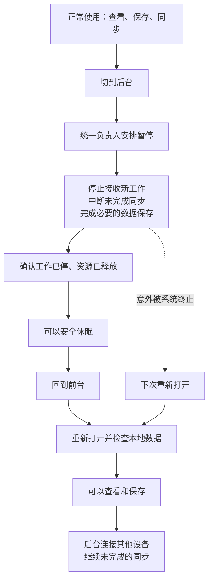
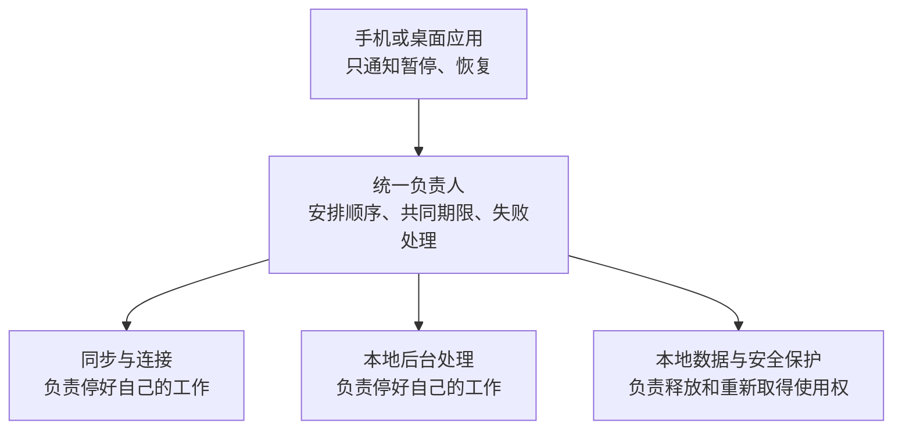

# 1. Overview

状态：实施中。统一负责人已接入三类现有能力及不可逆关闭意图，稳定入口的通知顺序、启动中目标、公开操作门禁、移动通知独立转交、本地恢复故障拒绝、离线本地恢复、普通剪贴板投递意图、文件离线重启补送、取消或失效意图不复活、最终关闭与资料重置错误汇总、资源清单及已确认保存和传输中的进程终止验证已完成。共同期限的软件合同、会话与本地工作的同时停止通知、当前可用 iOS、Android 真机基线，以及 iOS 真机、iPhone 与 iPad 模拟器、Android 模拟器在启动、阻塞剪贴板与文件读写和短期限退出中的暂停证据已完成；其余阻塞操作的最坏占用证据、另一类受支持 iOS 实体系统、锁屏与传输中切换、HarmonyOS 及产品宿主矩阵仍待完成。局部修复不代表本规格完成。

iOS 退后台时 Engine 曾报告暂停成功，但真实文件租约仍被持有。现有修复已覆盖一部分释放和任务退出问题，
但暂停责任仍分散，停止预算不统一，恢复耦合网络运行期，重启也不保证未完成同步再次执行。
用户确认统一暂停/恢复约定：后台优先安全停止、本地恢复不等待其他设备、意外退出后安全恢复未完成工作。
本规格是后续实现唯一入口；已有复现、局部修改及真机结果保留在
[后台暂停安全记录](2026-09-12-background-suspension.md)，不得将其测试结果计作本规格验收。

# 2. Goals

- 暂停成功后，所有受管工作已退出或进入不持有挂起敏感资源的休眠状态；旧任务不能再次写入或取得租约。
- 所有参与者采用同一暂停/恢复 port、同一转换负责人和同一绝对停止期限。
- 已确认保存的数据在暂停、进程终止和重新启动后仍可读取；未确认完成的保存允许完整提交或完整回滚。
- 恢复本地数据可用后开放本地操作；远端不可达不阻塞本地查看和保存，也不触发 LAN 降级。
- 未完成同步在恢复或重启后重新调度；主动取消、删除、撤权和内容失效不会被恢复覆盖。
- 重复通知、启动中退后台、快速切换、部分失败和调用方取消均由同一转换负责人处理。

# 3. Non-Goals

- 不建立通用插件注册系统、动态依赖图或通用任务持久化框架。
- 不要求所有文件传输支持字节级断点续传；允许重新传输并通过现有身份与去重规则安全收敛。
- 不重放已被取消的 Engine 调用，不恢复用户主动取消的业务意图。
- 不取消安全互斥、绕过加密、延长系统后台时间或通过主动崩溃实现停止。
- 不在本规格设计阶段修改产品仓、发布版本或更新产品依赖；产品接入属于最终联合验收的必要交付项。

# 4. Current Architecture Context

Component: Engine 生命周期入口
Path: `crates/uc-engine/src/engine/mod.rs`、`engine/in_flight.rs`
Responsibility: 稳定状态、操作入口、调用取消与事件。
Relationship: `EngineRuntime` 转交生产生命周期；当前入口串行，但取消登记和运行期收尾分处两层。

Component: 生产运行期
Path: `crates/uc-engine/src/runtime/session_supervisor.rs`、`runtime/dispatch.rs`
Responsibility: session 构造、自动重建、暂停和恢复。
Relationship: 当前依次停止 session、进程后台工作、安全状态；恢复反向准备，但 session 构造和本地恢复尚未解耦。

Component: Application 后台工作
Path: `crates/uc-application/src/application.rs`、`clipboard/assembly.rs`、`search/runtime.rs`、`space/membership/maintenance/runtime.rs`
Responsibility: 完整业务流程与各自工作生命周期。
Relationship: 不同所有者已有不同停止入口，不能仅枚举新加的 Clipboard 工作者就视为覆盖全部。

Component: 安全及磁盘能力
Path: `crates/uc-infra/src/security/profile_content_key_vault/`、`space/security/active_space_security_session/`、`clipboard/background_runtime.rs`
Responsibility: 读写许可、租约、缓存及实际后台磁盘动作。
Relationship: 必须等使用者退出才可释放共享资源；永久 close 不能代替可恢复 suspend。

Component: 文件传输恢复
Path: `crates/uc-application/src/transfer/file/lifecycle.rs`、`transfer/file/assembly.rs`、`clipboard/sync/`
Responsibility: 传输尝试、取消、启动清理和同步调度。
Relationship: 现有启动清理包含 `bulk_fail_inflight`；失败投影不等价于持久同步意图已获恢复。

Component: 移动绑定
Path: `bindings/uc-engine-uniffi/src/runtime.rs`
Responsibility: 宿主命令投递和结果等待。
Relationship: 当前 `receive_lifecycle_result` 等待有上限，超时不会取消已投递命令；不是安全挂起的完成证明。

# 5. Proposed Design

## 最终图景

以下两图表示实现目标，不表示当前代码已经完成。正常恢复先检查本地数据，不等待其他设备在线。





| 使用场景 | 目标表现 |
| --- | --- |
| 正在同步时退后台 | 中断当前尝试，回来后继续；已确认保存的内容不丢 |
| 回到前台，其他设备不在线 | 本地准备完成即可查看和保存，不等待远端连接 |
| 快速来回切换 | 按顺序完成转换，不重复启动工作 |
| 系统突然终止程序 | 下次打开检查并恢复仍然有效的未完成工作 |
| 用户已经取消同步 | 不因恢复或重启再次开始 |
| 本地数据暂时无法安全打开 | 明确报告未恢复，不开放依赖该数据的工作 |

新增后台功能必须接入同一管理并通过停止、恢复验证。图中暂停与恢复成功路径的失败处理、
期限耗尽及资源依赖约束见下文 Workflow，不能从简图推断所有转换总能成功。

## Components

完整负责人是 Application 内部新增的 `RuntimeLifecycleCoordinator`，它只处理运行生命周期，
不掌握成员协议、内容同步或密钥处理的业务步骤。Engine 保留稳定入口和组装职责，将目标状态与期限一次交给负责人，
根据最终结果发布状态；不得再维护第二份参与者顺序或失败回滚。

`RuntimeLifecyclePort` 与负责人放在 `crates/uc-application/src/runtime_lifecycle/`。
该层直接消费能力，因此 port 不放 Core，也不让 Infra 反向依赖 Engine。
Infra 的完整能力所有者实现 port；位于 Engine 的现有 session 装配通过 Engine 内部 adapter 接入同一 port。
原有门禁、任务登记等控制能力由组装注入，迁移时删除重复转换状态。

采用具名的必填参与者，不采用任意 `Vec` 加动态优先级：

| 参与者 | 完整责任 | 暂停前置条件 | 恢复前置条件 |
| --- | --- | --- | --- |
| 会话工作 | 网络收发、传输尝试、成员维护、自动连接及重建 | 全局入口关闭 | 本地资源准备完成 |
| 本地后台工作 | 内容物化、spool 清理、搜索与历史维护 | 全局入口关闭 | 本地资源准备完成 |
| 本地资源 | 存储使用权、安全缓存、数据库事务与相关持久访问 | 前两类及在途宿主调用全部停止 | 无 |

每项只负责它实际拥有的完整能力；嵌套工作由其唯一上级负责，禁止同一任务被多次注册。
以上为目标归属，实施前须逐项核对当前搜索、历史维护、传输超时任务及观测写入的实际所有者。
进程级观测不随普通暂停永久关闭；其文件访问也必须核实不会违反挂起条件。

## Data Model

- `LifecycleTarget`：本次目标 Active 或 Suspended；最终关闭保留独立终止语义。
- `TransitionContext`：转换代次与单调时钟绝对期限；队列等待、锁等待、停止和失败回收都消耗同一预算。
- 内部阶段：Active、Suspending、Suspended、Resuming、Incomplete、Stopped。
- `Incomplete`：资源安全尚未得到证明，入口继续关闭，不能对外映射成 Suspended；下一次请求先完成收尾。
- 每个参与者记录当前代次和已完成动作，使重试不会重复启动；这些短期状态不持久化。
- 业务恢复依据已有持久记录，不依据生命周期状态。缺失的同步意图字段由所属业务模块补齐并默认加密。

同步恢复需区分“持久意图”和“一次传输尝试”：后台停止结束尝试但保留意图，用户取消则使意图终止。
尝试失败可以更新展示状态，但不能抹去仍应同步的意图。恢复前重新检查内容存在性、成员权限与取消状态。
取消和恢复领取必须使用原有事务或版本比较保证互斥；没有原有能力时在业务所有者内增加最小持久支持。
不能仅凭内存队列承诺跨进程恢复，也不能把新业务负载明文加入通用生命周期日志。

## API / Interface

内部接口合同如下，具体 Rust 声明在实施时遵循现有异步 trait 和错误规范：

| 方法 | 输入 | 成功保证 | 失败保证 |
| --- | --- | --- | --- |
| `RuntimeLifecyclePort::suspend` | 共享 `TransitionContext` | 本参与者停止完成，不再持有其应交接资源 | 保留原始错误链，说明未完成，禁止伪造安全 |
| `RuntimeLifecyclePort::resume` | 共享 `TransitionContext` | 本参与者已本地就绪，后台网络重试已受管 | 不留下无人接管的部分启动任务，仍可调用 suspend 清理 |
| `RuntimeLifecycleCoordinator::transition` | 目标、共享期限 | 所有必要参与者到达目标 | 返回明确未完成结果并持有继续收尾责任 |

每个参与者的方法必须可重试；禁止默认空实现掩盖未接入的工作。无需生命周期能力的配置由明确的禁用 adapter 表达。
不增加 `is_safe` 轮询接口；成功结果本身即为证明，负责人不读取参与者内部阶段。

稳定 Engine 入口保留调用方一次暂停/恢复的形态，增加接收剩余预算的完整操作选项。
绑定在请求入队时转换为绝对期限；宿主不能传各内部步骤的预算，也不能读取内部参与者列表。
现有无参数调用可委托同一实现和默认策略，不能形成另一条生命周期路径。
跨语言返回需区分完成、未完成与命令未被接收；等待超时不能伪装成完成或普通业务失败。

## 代码示例

以下为结构示意，不是可直接编译的补丁。`TransitionContext`、`LifecycleError`、`pause_and_drain` 和
`ensure_workers_stopped` 是拟新增或调整的名称；具体定义须遵循上文合同及仓库错误处理规范。
示例省略了集中导入、统一入口门禁、在途宿主调用等待、转换代次、状态发布和执行任务所有权，实施时不能省略这些责任。

### 共同约定

```rust
#[async_trait]
pub trait RuntimeLifecyclePort: Send + Sync {
    async fn suspend(
        &self,
        context: &TransitionContext,
    ) -> Result<(), LifecycleError>;

    async fn resume(
        &self,
        context: &TransitionContext,
    ) -> Result<(), LifecycleError>;
}
```

`context` 包含本次转换的共同绝对期限，各参与者不能重新计时。`suspend` 成功必须代表实际停止完成，
不能只发送取消通知。`resume` 成功代表本参与者本地就绪，不代表其他设备已经连接。

### 完整工作负责人实现约定

```rust
#[async_trait]
impl RuntimeLifecyclePort for ClipboardBackgroundRuntime {
    async fn suspend(
        &self,
        context: &TransitionContext,
    ) -> Result<(), LifecycleError> {
        self.activity.pause_and_drain(context).await
    }

    async fn resume(
        &self,
        _context: &TransitionContext,
    ) -> Result<(), LifecycleError> {
        self.activity.resume().await;
        Ok(())
    }
}
```

`pause_and_drain` 在同一边界阻止新动作，并等待当前必要保存完成或回滚。总负责人不知道内部队列及任务列表。
示例的恢复仅适用于有界的本地开闸；如果实际恢复会等待锁、读盘或执行回收，也必须消费 `context` 的剩余预算，
不能因为示例使用 `_context` 就忽略期限。安全资源负责人实现相同 port，但负责租约交接及缓存重读。

### 总负责人管理顺序和结果

```rust
struct RuntimeLifecycleCoordinator {
    session_work: Arc<dyn RuntimeLifecyclePort>,
    local_work: Arc<dyn RuntimeLifecyclePort>,
    local_resources: Arc<dyn RuntimeLifecyclePort>,
}

impl RuntimeLifecycleCoordinator {
    async fn suspend(
        &self,
        context: &TransitionContext,
    ) -> Result<(), LifecycleError> {
        let (session, local) = tokio::join!(
            self.session_work.suspend(context),
            self.local_work.suspend(context),
        );

        // 等两边各自完成收尾后检查结果，保留所有失败的原始错误链。
        ensure_workers_stopped(session, local)?;

        // 使用者全部停止后，才能交接它们依赖的资源。
        self.local_resources.suspend(context).await
    }
}
```

此处并发只适用于已经确认相互独立的两组工作。不得改成首个错误就丢弃另一方 future 的处理方式。
`ensure_workers_stopped` 必须合并两边失败并保留 source chain，不能字符串化或只留下第一个错误。
示例执行前必须已经关闭入口；释放资源前还必须确认在途宿主调用退出。`join!` 本身不提供停止期限或阻塞调用中断能力。

### 恢复失败的收尾示例

假设本地资源恢复成功，而后台处理启动到一半失败：负责人先对失败的后台处理执行 `suspend`，
确认它新建的任务全部退出，再暂停本地资源。若会话工作也已经启动，同样先停止它。
回收沿用本次剩余预算，保留启动失败和回收失败的原因；回收未完成则保持 Incomplete，不能开放入口。

具体迁移时，从 `SessionSupervisor` 移出分散的生命周期顺序与回收安排，由统一负责人执行；
现有后台处理及安全资源接入 port。不要在旧安排外再包一层转发，也不要让 Engine 重复维护恢复回滚。

## Workflow

### 暂停

1. 负责人关闭新工作入口，撤销当前代次的重建及重试许可；正在启动的任务也必须登记在同一代次内。
2. 通知会话工作、本地后台工作和在途调用停止。通知应及时发出，不能先等待某个慢参与者才通知其他工作。
3. 等待各工作到达安全边界：短事务提交或回滚，取消后的任务真正退出；网络传输无需等待完成。
4. 独立参与者失败不阻止其他可安全进行的收尾；只要仍有资源使用者，不能继续释放其依赖资源。
5. 所有使用者退出后暂停本地资源，撤销缓存、结束事务并释放需交接租约。
6. 全部成功才发布 Suspended。超时或部分失败保留 Incomplete 和关闭入口，由同一负责人继续收尾或接受重试。

### 恢复

1. 若上次暂停尚未完成，先收尾，禁止新旧代次重叠运行。
2. 本地资源重新取得使用权并加载最新持久状态；加密数据无法安全打开则恢复失败。
3. 初始化本地能力，并启动受管的网络调度；本步骤不等待任何远端在线或握手完成。
4. 所有本地必要条件成立后开放入口并发布 Active。网络不可达沿既有恢复机制重试，认证/撤权失败按业务规则处理。
5. 本地必要步骤失败时，按依赖顺序暂停本次已启动及失败参与者；回收也使用剩余预算，未完成则进入 Incomplete。

### 快速切换、关闭和意外退出

转换执行由负责人持有，调用方丢弃等待不能丢弃收尾任务。连续通知只保留最新目标，已接受暂停仍先到达安全边界，
再按最新目标恢复；旧完成通知不得覆盖新代次。最终关闭阻止任何后续恢复。
重新启动不尝试复活旧异步调用；由传输、同步等业务所有者分别读取持久意图，进行幂等恢复。

### 时间耗尽的硬边界

共享期限是全流程停止要求，不是 `timeout` 包裹任意 future 就能兑现的保证。
每个磁盘临界区、阻塞调用和任务析构必须提供实测上界或可验证的取消方式；不可取消阻塞工作不能靠 `abort` 宣称停止。
负责人超时后继续收尾只保证责任不丢失，不能保证系统给它时间。宿主执行时间到期且尚未安全的路径是验收失败，
不得以返回错误、释放外层锁、结束 UIKit 后台活动或延长等待掩盖。
产品接入必须证明成功完成与结束后台活动的先后关系；无法证明的参与者必须修改其资源访问方式后才能宣告交付。

# 6. Implementation Plan

1. **资源与恢复清单**：核对 `runtime/`、Application 各工作者、Infra 持久访问及绑定，记录所有者、停止方式、最长临界区、
   重启依据和测试入口。风险：遗漏进程级任务；清单完整是下一步门禁。
2. **统一负责人和 port**：新增 Application 内部模块，Engine 组装三类必填参与者；移入顺序、代次、门禁与重试责任。
   先完成真实保存→暂停交接→恢复读取的最小闭环，保留已有通过的回归。风险：双重状态机或锁顺序死锁。
3. **本地恢复独立**：调整 `session_supervisor.rs` 的构造与恢复，将远端连接留给已有连接恢复负责人；
   本地必要恢复失败必须返回失败，不能仅 warning 后开放入口。风险：锁定状态、无 Space 初始状态与故障状态混淆。
4. **共同预算与绑定**：修改 Engine 完整操作选项及 UniFFI 命令封装，取消各层重新计时；覆盖等待方超时和取消。
   风险：仅缩短等待却遗留实际工作；必须以资源释放断言验收。
5. **持久同步恢复**：调整 `transfer/file/lifecycle.rs` 与所属同步流程，区分暂停尝试和主动取消，核对并补齐事务持久意图。
   风险：重复发送、撤权后重试、取消被覆盖和迁移兼容；以重启后的业务结果验收。
6. **联合验证和文档收口**：更新测试宿主及生成绑定，验证移动宿主剩余时间传入和后台活动完成逻辑；
   实际产品接入后执行真机矩阵。实现完成再更新稳定设计，移除旧的分散入口，归档本规格。

## 实施记录：资源与恢复清单

本清单在 2026-09-13 按当前实现重新核对。它回答“谁负责、从哪里停止、用什么验证”，并覆盖运行期工作者、
持久访问、网络嵌套任务、进程线程及绑定命令。清单完整不代表耗时验收完成；现有取消通知、固定等待值和一次正常执行耗时
均不构成磁盘临界区的最坏上界。

| 工作或资源 | 当前唯一所有者与代码入口 | 当前停止与恢复方式 | 临界区与缺口 | 实际验证入口 |
| --- | --- | --- | --- | --- |
| 宿主操作 | `crates/uc-engine/src/engine/operation.rs` 与 `crates/uc-engine/src/engine/in_flight.rs` | 操作门先拒绝新工作；已登记动作由独立所有者完成，暂停等待实际退出 | 专用 iOS 宿主已证明文件导入读取或导出写入结束前暂停不成功，50 毫秒期限到期会明确报告未完成并继续收尾；其余动作仍需测量最坏时长 | Engine 操作取消、真实数据库锁竞争、iOS 文件读写及启动中切换测试 |
| 生命周期命令与启动交接 | `crates/uc-engine/src/engine/lifecycle/queue.rs`、`crates/uc-engine/src/engine/startup_owner.rs` | 单一队列保存顺序与最新目标；启动前后转交同一运行期，等待方离开不取消收尾 | 专用 iOS 宿主已证明安全存储读取阻塞期间收到的暂停会在启动完成前落实；50 毫秒期限到期明确报告未完成，启动交接后仍保留暂停目标；其他启动资源和平台仍需核对 | Engine 生命周期、启动所有者、UniFFI 公开合同及 iOS 启动中切换测试 |
| 会话重建 | `crates/uc-engine/src/runtime/session_supervisor/` | 关闭操作门，完整停止旧会话；本地资料成功恢复后才开门，失败时反向回收 | 整次构造中不可中断步骤仍需设备上界 | 会话生命周期、启动回收及真实宿主离线恢复测试 |
| Application 领域工作 | `crates/uc-application/src/application/shutdown/owners.rs` | 同时停止历史、文件超时、搜索、Space、普通剪贴板和活动剪贴板，等待全部结果并汇总异常 | 每项内部磁盘动作仍需共同期限证据 | Application shutdown、各领域 lifecycle 测试 |
| 内容物化与 spool | `crates/uc-infra/src/clipboard/background_runtime.rs`、`crates/uc-infra/src/clipboard/background_activity.rs` | 进程 `TaskRegistry` 持有工作；暂停门等待当前完整磁盘动作后交接，暂停前或暂停期间到点的旧清理批次不在恢复后补跑 | 大内容读写及目录扫描最坏时长未证明 | background activity、blob worker 与真实保存后重开测试 |
| 搜索重建及修复 | `crates/uc-application/src/search/runtime.rs`、`crates/uc-application/src/search/coordinator.rs` | Search runtime 持有任务范围；停止后等待已经开始的索引动作真正退出 | SQLite 索引完整写入的最坏时长未证明 | 搜索协调器阻塞线程与 Application 关闭测试 |
| 剪贴板发送、接收与活动广播 | `crates/uc-application/src/clipboard/sync/`、`crates/uc-application/src/clipboard/inbound/`、`crates/uc-application/src/clipboard/active/` | 各自私有工作负责人登记完整动作，`ClipboardSession` 统一通知并排空 | iOS 专用宿主已证明阻塞读取或写入结束前暂停不成功；生产拉取和保存的最坏时长仍未证明 | 发送、接收、活动剪贴板关闭、离线恢复及 iOS 阻塞读写真机测试 |
| 历史维护 | `crates/uc-application/src/clipboard/history/maintenance_runtime.rs` | Application 拥有；当前动作完整结算，后续动作在停止边界退出 | 核对和清理单轮最坏时长未证明 | history maintenance 生命周期测试 |
| 文件接收与超时清理 | `crates/uc-application/src/transfer/file/session.rs`、`crates/uc-application/src/transfer/file/shutdown.rs`、`crates/uc-application/src/transfer/file/timeout_runtime.rs` | 接收会话由私有关闭负责人逐项完整取消；超时工作由 Application 停止并等待 | 文件发布与清理的最坏时长仍待设备验收 | 文件关闭、超时工作、离线重启补送及传输中进程终止测试 |
| 成员维护与自动连接 | `crates/uc-application/src/space/membership/maintenance/runtime.rs`、`crates/uc-application/src/space/connectivity/` | Space runtime 拥有；停止当前完整轮次并保留异常，不再使用独立五秒后放弃 | 单轮持久访问最坏时长未证明 | membership maintenance、peer connections 与 Space shutdown 测试 |
| Iroh Router、协议处理器与下载 | `crates/uc-infra/src/network/iroh/node/shutdown.rs`、`crates/uc-infra/src/network/iroh/blobs.rs` | `SyncEngineAssembly` 先停进度工作，再关闭 Router、endpoint 和观测任务；慢收尾继续由原所有者等待，下载取消关闭对应连接 | 真实弱网和大文件下 Router/下载退出上界仍待设备验证 | Iroh 多异常关闭、慢处理器资源释放及文件传输测试 |
| 本地安全资料与租约 | `crates/uc-infra/src/security/profile_content_key_vault/`、`crates/uc-infra/src/space/security/` | 安装、冷读取、文件租约和系统安全存储访问均由私有所有者持有；使用者全部退出后才清缓存和交还租约 | 系统安全存储及目录同步的设备上界未证明 | Vault 锁竞争、阻塞安全存储、暂停交接及进程重开测试 |
| SQLite 连接及事务 | `crates/uc-infra/src/db/executor.rs`、`crates/uc-infra/src/db/pool.rs` 及各 repository 私有阻塞所有者 | 业务负责人等待完整数据库调用；资料切换只在上层工作全部结束后替换连接池 | 5 秒 busy timeout 不是事务总上界；全库设备耗时仍待测量 | 发送记录、活动登记真实锁竞争及各 repository 回归测试 |
| 进程任务与诊断线程 | `crates/uc-engine/src/runtime/task_shutdown.rs`、`crates/uc-core/src/task_registry.rs`、`crates/uc-observability-runtime/src/local_file.rs` | Engine 最终关闭等待任务登记实际退出；诊断线程以有界队列刷新并在最终关闭时 join | 普通暂停保留进程级诊断能力；文件刷新最坏时长待测 | TaskRegistry 取消/异常测试、Engine 最终关闭及 local file 刷新/关闭测试 |
| 移动绑定与兼容线命令 | `bindings/uc-engine-uniffi/src/runtime/`、`bindings/uc-ohos-napi/`、`compatibility/uc-mobile*/` | 绑定线程只负责命令转交；生命周期在普通调用阻塞时仍可入队，已接收收尾不随等待超时丢失 | iOS、Android、HarmonyOS 的真实系统回调和期限仍待设备矩阵 | UniFFI 单线程宿主、公开合同及兼容线检查 |

#### 阻塞访问与网络嵌套工作的完整归属

- Blob 摘要、复制、链接、文件系统发布、隐藏属性、配置迁移、隐私迁移、密钥文件与系统安全存储访问，均由发起它们的
  完整业务动作持有；调用方取消只停止等待，所有者继续等待阻塞线程结束，再向生命周期负责人报告完成。
- SQLite 主库、搜索索引、活动登记和送达记录的阻塞调用均由对应 repository 或 coordinator 私有持有；数据库池不另设
  生命周期接口，上层只在全部使用者停止后切换或释放资料。密码计算、网络探测等非磁盘阻塞工作同样归其完整调用所有。
- Iroh 的 Router 拥有协议处理器及 blob store，下载器内部任务通过连接关闭停止；节点关闭会等待 Router 的唯一 join、endpoint
  和连接观测任务，慢收尾只报告诊断而不放弃所有权。进度翻译在节点关闭前由 `SyncEngineAssembly` 单独停止。
- UniFFI、HarmonyOS、兼容线和观测运行期中的独立线程均有明确 join 或进程级保留规则。测试辅助代码中的阻塞调用不计入
  生产资源，但继续由测试本身回收。全仓搜索到的生产阻塞入口均已归入上述类别；新增入口必须同步更新本表。

### 持久恢复依据

- `clipboard/sync/sync_runtime/recovery.rs` 使用既有送达记录恢复 Pending 与 Unreachable；每台目标在开始发送前先写 Pending，
  因而结果落盘前终止也可在重启后重试。恢复继续检查当前成员、同步开关和内容有效性，并由更新内容替代更旧的离线内容。
- 文件发送复用同一条目送达记录，真实双 Engine 测试已覆盖接收端退出、发送端离线保存文件及接收端以原资料重启后自动补送。
  接收侧 reconciliation 仍只负责清理未完成展示状态，不被误作发送意图。
- 搜索用已持久化的 blocked 状态触发重建；spool 使用启动扫描恢复物化。两者都必须补充强制终止后的真实目录验证。
- Vault 恢复重新读取持久资料；已确认内容及传输中的真实子进程终止恢复已经验证。已删除内容不进入恢复扫描，已替代或明确
  失败的记录不具备恢复资格；目标明确不在当前成员范围时持久结算为 Superseded，暂时暂停或范围读取失败则保留原意图。

### 当前验证

- 已运行 `cargo metadata --locked --format-version 1`，成功。
- 已运行 `cargo test -p uc-engine --test host_contract suspended_engine_releases_profile_lease_and_can_resume --locked -- --nocapture`，
  1 项通过。实际覆盖保存、暂停释放租约、另一持有者占用时恢复失败、释放后恢复读取与再次保存；测试运行 8.50 秒。
  这是本次重新执行的基准，不覆盖统一负责人、共同期限或重启同步恢复。
- 资源清单已按当前生产入口收口，网络 provider/fetch、数据库连接池、独立线程和阻塞访问均有唯一归属及验证入口。
  阶段 1 的清单门禁完成；最坏占用上界属于阶段 4 和设备验收，仍不得据此宣告总规格完成。
- `cargo check --workspace --all-targets --locked`、`cargo fmt --all -- --check`、Rust 风格检查、仓库架构及隐私检查、
  `git diff --check` 均通过。整仓检查仅报告 HarmonyOS 测试中的现有未使用导入警告。
- 以上为 2026-09-12 盘点基准；当时未修改生产 Rust 实现。后续实施以下方按日记录为准。

### 2026-09-13：本地恢复失败不得开放入口

- 完整负责人暂仍是现有 SessionSupervisor；此次先落实其本地恢复成功条件，不新增另一套转换顺序。
  调用方仍只调用 Engine 的恢复入口；成功才开放操作，读取故障返回失败并由现有恢复路径交还安全租约，允许后续重试。
- `install_new_session` 不再把当前资料读取、损坏或就绪失败降为警告后开放入口。明确的 `KeyringMiss`
  继续作为正常锁定状态处理；需要完成 Space 切换时仍要求真正解锁。
- 已构造会话在检查待完成切换失败、本地恢复失败、切换后未解锁三条路径上，先执行完整会话关闭再返回错误。
  这避免失败分支直接丢弃仍有后台工作的会话；未声称解决关闭内部已有的错误只警告或阻塞任务上界问题。
- 真实宿主测试只对 `kek:v1:` 恢复读取注入失败，确保故障越过网络设置准备，命中原先警告后继续的分支。
  修改前测试在“本地资料不可读时不能报告恢复成功”断言失败；修改后 `host_contract` 全部 3 项通过。
  验证同时检查失败后维持暂停、拒绝保存、真实文件租约可交接，以及解除故障后的读取和再次保存。
- 同日 `runtime::session_supervisor::tests` 全部 7 项通过；重新运行 metadata、workspace 全目标检查、fmt、
  Rust 风格、仓库架构及隐私检查、diff 检查，均通过。仅有既存测试未使用导入/辅助函数警告。
- 阶段 3 的故障拒绝切片已实现；本地恢复与网络构造解耦尚未实现。阶段 2、4、5、6 尚未完成，
  资源清单中待验证的阻塞访问仍保留；真机、强制终止和产品接入矩阵跳过，总验收不勾选。

### 2026-09-13：历史维护在完整动作之间响应停止

- HistoryMaintenanceRuntime 继续独占历史维护任务；停止请求等待当前文件核对或清理动作结束，
  然后跳过尚未开始的缓存删除与保留策略删除，不通过丢弃磁盘操作 future 缩短等待。
- 启动尾部清理与周期维护使用同一取消检查；正常执行仍保持核对、缓存清理、保留策略的顺序，
  核对失败时仍跳过删除。下次运行沿现有维护触发重新检查，不持久化生命周期状态。
- 关闭失败保留原始 JoinError 并使用固定对外说明，不再字符串化任务失败。
- 定向 9 项测试通过，包括当前动作未完成时不能结束停止、核对后停止不启动缓存清理、
  缓存清理后停止不启动保留策略，以及 panic 的 source 与公开文本检查。
- 真实 `host_contract` 3 项回归通过；metadata、workspace 全目标、fmt、Rust 风格、架构及隐私、diff 检查均通过，
  仅保留 HarmonyOS 测试原有未使用导入警告。
- 本切片不提供磁盘动作最坏时长，不改变 ApplicationRuntime 与 Engine 的整体停止结果传播；
  统一负责人及全部参与者故障汇总仍未完成，不据此勾选整体暂停验收。

### 2026-09-13：统一负责人首个真实接入切片

- Application 的 `runtime_lifecycle/` 持有三类必填参与者与转换状态；Engine 只组装会话 adapter、
  ApplicationAssembly 本地后台能力及 Infra 安全资源能力，SessionSupervisor 的暂停/恢复入口提交目标。
  删除原有跨参与者顺序、恢复失败回收，以及 `suspend_process_runtime` / `resume_process_runtime`、
  `suspend_security_session` / `resume_security_session` 分散入口。
- 模块按职责拆分：入口只导出，参与者合同放 `ports.rs`，目标及共享上下文放 `model.rs`，
  失败集合放 `error.rs`，转换状态与执行任务由 `coordinator.rs` 独占。不让参与者依赖协调器或其他参与者。
  三类依赖通过具名必填字段组装，不依靠同类型参数位置区分责任。
- 会话可能等待本地物化，因此先停会话、再停本地工作，不未经证明就并发关闭两者。
  两项工作都成功停止后才交还资源；一项停止失败仍尝试另一项，所有原因保留在同一错误报告中。
  恢复先准备资源和本地工作，再安装会话；恢复失败调用同一暂停收尾，回收失败后下一次请求先重试清理。
- 转换执行任务持有负责人，等待方离开不会丢弃收尾；转换串行，重复目标不重复启动参与者。
  SessionSupervisor 的原子标记只作为旧网络重建许可保留，尚未迁移外层 Engine 宿主门禁与状态发布。
- 上下文包含代次和可选绝对期限，本切片生产无参数入口仍传 None；当前参与者尚未全部执行期限检查。
  不将上下文传递测试记为停止预算通过，不宣称保证平台剩余时间内完成。
- 最终关闭仍沿原生产关闭路径，连续目标合并、启动中退后台、全局门禁、进程诊断写入、
  下层停止错误的完整汇总及持久同步恢复仍未完成。阶段 2 仅记录真实接入切片，不勾选整体验收。
- 拆分后 6 项协调测试、8 项会话与错误映射测试、3 项真实宿主回归通过。真实测试覆盖保存、暂停交接、
  租约冲突、恢复读取故障、失败后禁止保存、解除故障后恢复读取及再次保存。
- metadata、workspace 全目标、fmt、Rust 风格、仓库架构及隐私、diff 检查通过；
  仅有既存测试未使用导入或辅助函数警告。设备与产品接入验证仍跳过。

### 2026-09-13：不可逆关闭与资源释放顺序

- 统一负责人接受关闭后永久拒绝恢复；关闭失败保留收尾重试能力，重复关闭不重复执行已完成工作。
  恢复中的每项能力启动前后检查关闭意图，已开始的动作完成后统一回收，不继续启动下一项。
  关闭等待方离开不取消已接受的收尾。
- Engine 最终关闭与资料重置接入同一关闭入口，先停会话和本地工作，再完成剩余任务关闭，
  最后永久关闭安全资源及清除构造能力。删除原先先关闭安全资源再停止工作的顺序。
- 关闭后的恢复错误映射为不可重试的无效状态；模块仍按合同、模型、错误和协调职责组织。
- 全局宿主门禁、共同期限、底层任务关闭报告及错误汇总尚未统一；本切片不能证明平台预算内安全结束。
  设备与产品验证跳过。
- 9 项协调测试、8 项会话回归、3 项真实宿主测试通过；真实场景从运行状态直接关闭，验证租约释放且不能恢复。
  metadata、workspace 全目标编译、fmt、Rust 风格、架构及隐私、diff 检查通过；仅有既存测试未使用内容警告。

### 2026-09-13：外层关闭结果与收尾重试

- 完整负责人：Engine 负责宿主可见的关闭结果，调用方继续只调用 `shutdown`；统一 Application 负责人仍负责参与者顺序。
- 关闭返回错误或超时后保持 `ShuttingDown`，保留事件流，拒绝恢复与普通操作；只有成功才发布 `Stopped` 并关闭事件流。
  同一入口允许从 `ShuttingDown` 重试收尾，不把不可恢复的业务错误改成可重试错误。
- 验证覆盖明确失败、阻塞超时、等待方取消后的重试，以及最终成功状态和事件流关闭。
- 本切片不改变外层 timeout 取消关闭 future 的现状，不宣称全部关闭任务独立执行；共同期限与底层错误汇总仍待完成。
- 21 项 Engine 相关测试与 3 项真实宿主测试通过；metadata、workspace 全目标编译、fmt、Rust 风格、
  仓库架构及隐私、diff 检查通过，仅有既存测试未使用内容警告。设备矩阵跳过。

### 2026-09-13：关闭等待与实际执行分离

- Engine 的 `shutdown.rs` 独占宿主关闭等待与最终结果发布；进入 `ShuttingDown` 后由任务持有运行期、
  状态、事件通道和关闭许可。调用方只等待结果，等待超时或丢弃 Engine 不取消已经开始的实际收尾。
- 同时或再次关闭必须先等待当前关闭许可，不重复启动；已成功关闭直接确认成功，实际失败后可以重试收尾。
  `lifecycle_gate` 只保护状态转换，关闭期间普通操作与恢复仍能及时得到拒绝。
- 在调用入口建立绝对期限，关闭及生命周期排队计入同一等待预算；再次等待不重置已启动任务的预算。
  无法表示的期限在任何状态修改前拒绝，避免时间加法 panic。
- 验证目标包含等待超时后继续执行、重复请求不重启、调用方和 Engine 都释放后仍结束事件流、排队耗时和极大期限。
- 限制：进入 `ShuttingDown` 前的操作排空仍随原调用执行；下层参与者共同期限及完整错误汇总未完成，
  不据此声称平台剩余时间内完成停止。设备验证跳过。
- 24 项 Engine 相关测试与 3 项真实宿主测试通过，覆盖零等待仍启动并完成收尾；metadata、workspace 全目标编译、
  fmt、Rust 风格、仓库架构及隐私、diff 检查通过，仅有既存测试未使用内容警告。

### 2026-09-13：关闭前操作排空由任务持有

- Engine 在获得关闭及生命周期许可后直接发布 `ShuttingDown` 并启动唯一关闭任务；操作排空、取消通知、
  实际退出等待及运行期关闭全部由该任务持有，不再由宿主等待 future 持有前半段。
- 宽限结束只通知取消并发布取消结果；操作登记未实际释放时，继续持有运行期，不调用其关闭入口。
  宿主等待可以超时，但不能据此发布 `Stopped`。普通 `quiesce` 行为保持原合同。
- 验证在操作排空中丢弃关闭等待方与 Engine，保持旧操作登记，检查取消通知后运行期仍未关闭；
  释放登记后确认唯一关闭与事件流结束。新操作和恢复在已接受关闭后立即拒绝。
- 排队阶段尚未接受的关闭请求仍由等待方持有；下层共同期限及错误完整汇总未完成，设备矩阵跳过。
- 25 项 Engine 相关测试及 3 项真实宿主测试通过；metadata、workspace 全目标编译、fmt、Rust 风格、
  仓库架构及隐私、diff 检查通过，仅有既存测试未使用内容警告。

### 2026-09-13：Application 关闭失败返回生产调用方

- FileTransferTimeoutRuntime 回归 transfer/file 领域目录；等待正常退出时保留任务错误，强制取消后等待实际析构并返回原始 JoinError。
- ApplicationShutdownReport 汇总历史维护、超时任务与搜索的全部类型化来源。生产会话关闭继续执行网络清理后才返回失败，
  SessionSupervisor 的暂停、重建、重置及 Space 切换消费该结果，不能在关闭失败后继续安装新会话。
- 本地恢复失败后的清理同时保留首因和清理失败，直到 Engine 稳定错误转换边界；不把原始失败替换成字符串。
- 尚未完成 TaskRegistry 和 Iroh 停止失败的完整汇总、共同期限及设备验证，不据此勾选整体关闭验收。
- 18 项 Application 关闭测试、8 项会话测试、3 项真实宿主测试通过；metadata、workspace 全目标、
  Engine lan-compat 全目标、fmt、Rust 风格、架构与隐私、diff 检查通过，仅有既存测试未使用内容警告。

### 2026-09-13：后台任务报告与资料重置停止边界

- TaskRegistry 在保持原有停止和析构顺序的基础上保留全部 JoinError；报告的 Debug/Display 不暴露 panic 负载。
  标准 source 指向首个失败，其余失败可在同一报告内追溯。
- 会话关闭、最终关闭、资料重置均检查报告。任务已经实际退出时继续永久资源收尾，最终返回失败；
  任务取消超时经过嵌套报告仍保持 DeadlineExceeded 分类。
- StopProfileRuntimePort 与统一生命周期共享错误合同，资料重置保留停止 source，不在停止失败后启动密钥或数据删除；
  解除停止故障后可由同一入口重试。未修改资料重置其他失败类型及持久化阶段语义。
- Iroh 下层完整报告、统一期限和设备验收仍未完成。
- 显式启用 task-registry 的 4 项任务测试、6 项资料重置测试、9 项会话测试和 3 项真实宿主测试通过；
  metadata、workspace 全目标、fmt、Rust 风格、架构与隐私、diff 检查通过，仅有既存测试未使用内容警告。

### 2026-09-13：Iroh 慢收尾不丢弃协议资源

- 当前锁定的 Iroh Router.shutdown 首次调用会取走任务句柄，后续调用看到取消标记会直接成功；
  因此不能在 watchdog 到期后丢弃原 future 或重新调用关闭。
- 节点在 watchdog 后继续等待同一关闭 future，保留节点许可直至协议处理器实际结束；
  watchdog 只记录固定慢收尾诊断，不作为安全完成依据。实现归 node/shutdown，调用入口保持不变。
- 验证使用真实 Router 和故意阻塞关闭的协议处理器，检查超过 watchdog 后资源仍被持有且节点未报告关闭；
  放行处理器后检查资源释放。Iroh 结构化失败返回及共同期限仍待完成，设备矩阵跳过。
- 新增真实慢收尾测试、32 项既有节点测试和 3 项真实宿主测试通过；受保护中继测试因缺少对应环境按原设置跳过。
  metadata、workspace 全目标、fmt、Rust 风格、架构与隐私、diff 检查通过，仅有既存测试未使用内容警告。

### 2026-09-13：UniFFI 关闭重试与入队期限

- MobileEngine 在关闭开始后拒绝普通请求，但保留生命周期通道到成功；失败或等待超时可以再次关闭，
  Worker 在失败后继续服务生命周期命令，普通请求通道结束不会提前退出该循环。
- Shutdown 命令在入队前固定绝对期限，处理时只传剩余预算；等待超时明确映射 DeadlineExceeded。
  事件流确认实际停止后允许确认迟到成功，不通过轮询内部参与者推测安全。
- 线程回收由 WorkerJoin 持有唯一 join 与最终结果；超时后继续回收，重复等待不会把空句柄视为成功，
  已完成失败不被后续等待掩盖。调用方销毁时仍交接到回收线程；启动观察者离开后保留 Engine 停止等待。
- 生命周期中断会话恢复后不再二次读取已结束的恢复任务；关闭实现、线程回收与大命令分派分开组织。
- 验证关闭失败后重试、排队耗时、迟到完成、重复 join、真实绑定零预算关闭后再次关闭及重开同一资料。
  真实移动设备和完整平台停止时限尚未验证。
- 27 项绑定内部测试与全部 24 项真实绑定合同测试通过；metadata、workspace 全目标、fmt、Rust 风格、
  架构与隐私、diff 检查通过，仅有既存测试未使用内容警告。未执行 iOS/Android 真机验收。

### 2026-09-13：关闭参与者共用绝对期限

- 生产关闭在开始时固定期限，经过网络恢复停止、统一负责人、会话操作排空、会话任务、Application 文件超时任务及最终任务回收时不重置；资料重置同样共用一次期限。
- TaskRegistry 在获取任务锁前计算期限；到期后仍取消并等待实际析构，因此“超时”表示未能优雅结束，不表示任务仍在运行。会话操作采用不同合同：未释放时报告超时并保持入口和旧会话，不能拆除其依赖；操作退出后允许再次关闭确认。
- 不带期限的既有内部恢复使用会话默认宽限；历史维护、存储和 Router 的必要收尾继续等待实际完成，不把期限传递等同于设备挂起时间已经达标。
- 完成标准：可控时钟验证锁排队、连续任务组和文件超时工作不获得新预算，真实 Engine 关闭及暂停恢复回归通过；重试仍由既有关闭负责人执行。
- 验证：Core 任务管理 6 项、Application 关闭 18 项及文件超时 3 项、会话管理 10 项、真实宿主 3 项通过；metadata、workspace 全目标、fmt、Rust 风格、架构与隐私、diff 检查通过。设备矩阵仍未执行。

### 2026-09-13：暂停与恢复不依赖等待方存活

- Engine 接受暂停、恢复及 quiesce 后，独立任务持有排队、执行与状态发布；调用方停止等待或释放 Engine 不丢弃已接受转换。
- 入口状态、排空和结果发布归 engine/lifecycle，Application 保持参与者通知与回收顺序；不在入口增加第二套参与者编排。
- 重复暂停、恢复确认现有状态，不重复执行底层动作；quiesce 队列耗时计入原等待期限。
- 完成标准：阻塞暂停/恢复后取消等待者，验证实际完成、最终事件、操作许可及不重复执行；排队时取消并销毁 Engine，仍完成资源回收。最新目标合并与启动中通知尚未完成。
- 验证：28 项 Engine 相关测试、补充后的 4 项等待取消与排队测试、3 项真实宿主及移动绑定暂停恢复测试通过；metadata、workspace 全目标、fmt、Rust 风格、架构与隐私、diff 检查通过。真机矩阵未执行。

### 2026-09-13：网络关闭失败完整返回

- Iroh 节点拥有网络恢复观察、连接观察和 Router 的全部关闭结果；异常不跳过剩余清理，摘要仅输出固定说明和数量。
- 故障注入发现先关闭 endpoint 会使 Router 提前结束并丢失其原始失败；现在先轮询 Router 关闭取得唯一 join，再并行关闭 endpoint 与观察者。若 Router 在接管前已自行结束，当前库无法再提供原始 join，明确返回提前结束错误，不伪报正常关闭。
- 连接观察保留提前回收的任务失败，首次异常后拒绝新增观察任务，避免长期积累无限失败记录；到期取消也等待析构并返回原始错误。
- 网络组装以进度工作实际 join 作为完成依据，移除重复确认通道；进度失败后仍关闭节点，再把完整结果交回会话负责人。Application 启动失败同时保留网络回收错误。
- 完成标准：真实 Router 与恢复任务同时故障后，原始失败均保留、资源释放且节点可以重开；观察任务提前失败和强制停止、进度任务失败均有测试。共同期限和最坏收尾时长尚未覆盖整个网络实现。
- 验证：节点 35 项通过、受保护中继 1 项按环境跳过；观察工作 2 项、进度工作 3 项、生产节点连续重开十次及真实宿主 3 项通过。metadata、workspace 全目标、fmt、Rust 风格、架构与隐私、diff 检查通过；未执行真机矩阵。

### 2026-09-13：高频进度通知下的有界收尾

- 进度工作归独立模块，网络组装不再承载节流与终态循环。收到关闭后固定当时接收位置，新通知不能延长本次排空；积压丢帧消耗对应旧位置，仍处理缓冲中的已完成终态。
- 关闭命令优先处理，最终确认仍等待实际任务退出；未新增截止时间配置或吞掉工作异常。
- 完成标准：宿主回调持续补入通知时只处理停止前进度；缓冲落后时保留最终完成状态，其余在途进度结束为取消；现有网络关闭与宿主回归通过。
- 验证：5 项进度测试与 3 项真实宿主测试通过；metadata、workspace 全目标、fmt、Rust 风格、架构与隐私、diff 检查通过。设备矩阵未执行。

### 2026-09-13：宿主暂停剩余时间入口

- Engine 的 suspend_with_deadline 与 UniFFI/HarmonyOS 同名完整动作入口接收剩余时间，入队前固定期限，排队、调用排空和统一参与者消耗同一次预算。UniFFI 原入口复用既有十秒默认值。
- 等待结束后已接受暂停继续执行；超时返回 DeadlineExceeded，不能作为安全暂停证明，可再次暂停确认最终结果。不可表示的 Engine 期限在接受请求前拒绝。
- 完成标准：可控时钟验证排队超时后的期限不重置、慢参与者继续收尾、非法预算不改变状态；真实绑定零预算后再次暂停并恢复正常工作。HarmonyOS 设备运行和 iOS/Android 系统后台验收仍未执行。
- 完整绑定回归发现资料重置错误地把最终任务组的 500 ms 宽限扩大为整个重置期限，前置清理消耗后迫使正常后台任务取消。资料重置没有宿主预算，恢复其无期限转换与最终任务组原有宽限；有宿主期限的暂停、关闭仍传递原绝对期限。新增直接生产重置测试保留完整错误来源并验证删除前确已停止。
- 验证：7 项暂停/排队边界、28 项绑定内部测试、全部 25 项真实绑定合同以及直接生产资料重置通过；metadata、workspace 全目标、Engine dev-tools+lan-compat 全目标、fmt、Rust 风格、架构与隐私、diff 检查通过。未执行设备系统后台矩阵。

### 2026-09-13：网络内部等待消费共同期限

- 会话把原期限传到网络组装与 Iroh 节点；连接观察不再无条件重新获得 500 ms，Router 诊断期限也不晚于宿主期限。
- 即使剩余时间为零，Router 仍持有原关闭 future 到协议资源实际退出；无宿主期限的工具调用使用现有默认等待值，不添加新的产品配置。
- 完成标准：可控时钟验证观察任务不重置过期期限，真实协议处理器验证零预算仍等待资源释放，正常节点与实际暂停恢复回归通过。磁盘阻塞动作的最坏上界仍未证明。
- 验证：节点 36 项通过、受保护中继 1 项跳过，观察工作 3 项、移动绑定零预算暂停恢复与退出空间通过；metadata、workspace 全目标、fmt、Rust 风格、架构与隐私、diff 检查通过。

### 2026-09-13：搜索停止保留实际磁盘工作

- 搜索负责人持有启动检查、重建、修复和清理直到实际完成；取消只在完整动作边界生效，不丢弃仍等待阻塞线程的 future。启动检查的调用方离开也不丢失该工作。
- 私有 task_scope 只负责登记、关闭与重新开放；暂停尚有旧工作时拒绝重开，永久关闭后不能恢复。重建决策与存储流程仍在协调器，模块入口只声明模块。
- 完成标准：真实阻塞线程未退出时暂停与关闭不完成；退出后可以恢复，永久关闭拒绝新工作。整次索引写入仍等待完成，不据此声称最坏耗时符合移动系统期限；搜索后台 panic 汇总和通用磁盘访问范围继续追踪。
- 验证：41 项搜索相关测试与 3 项真实宿主合同通过；metadata、workspace 全目标、fmt、Rust 风格、架构与隐私、diff 检查通过。启动等待取消与旧工作未结束时拒绝恢复均有直接覆盖。

### 2026-09-13：搜索异常收尾保留失败

- 搜索任务负责人保存后台任务的原始 JoinError；首次异常拒绝新增工作并通知已有工作停止，等待所有已登记工作退出后返回完整失败，重复暂停或最终关闭不清除失败。
- 启动检查等待包含失败登记，避免工作异常刚发生时返回成功；空间搜索活动保留原始错误链，不再把下层失败转成字符串。失败后的同一搜索运行期不重新开放，重建运行期由已有会话恢复负责人负责。
- 修复任务被关闭入口拒绝时撤销重复登记并释放并发名额，防止下次正常恢复后的查询无法重新安排修复。
- 完成标准：多个任务异常完整保留、其他工作仍完整收尾；暂停、恢复和最终关闭均能看见失败，公开摘要不输出异常负载；正常搜索和空间活动回归通过。
- 验证：45 项搜索相关测试、3 项空间活动测试与 3 项真实宿主合同通过；metadata、workspace 全目标、fmt、Rust 风格、架构与隐私、diff 检查通过。

### 2026-09-13：关闭请求从排队起由执行方持有

- Engine 接受有效关闭请求时即关闭操作准入；关闭许可与生命周期排队均放入持有运行期的执行任务，排队超时或等待方离开不撤回关闭。
- 排队仍消费原期限，开始实际收尾时只传递剩余预算；重复请求仍串行确认或重试，不与正在执行的关闭重复清理。
- 已开始的恢复结束后再次检查关闭意图，不发布 Running，不重新开放操作。参与者清理顺序仍由 Application 负责人决定。
- 完成标准：排队等待取消并释放 Engine 后仍实际停止；排队超时无需再次请求也完成关闭；恢复与关闭竞争时无迟到 Running，已有失败重试与零预算测试继续通过。
- 验证：37 项 Engine 相关测试及全部 25 项真实移动绑定合同通过；metadata、workspace 全目标、fmt、Rust 风格、架构与隐私、diff 检查通过。

### 2026-09-13：文件超时清理等待实际磁盘动作

- 文件超时工作接收停止后在记录之间退出；通知发送方已离开同样停止，取消优先于到期计时，不再把已关闭通知通道当成继续扫描的信号。
- 共同期限到达时仅记录固定运行诊断，仍等待原任务完成，不 abort 正在等待磁盘线程的任务。原始任务异常仍返回 Application 关闭汇总。
- 完成标准：实际阻塞线程尚持有资源时不能返回停止成功；过期期限不丢弃当前动作，工作通知通道关闭后即使接收已就绪也不启动扫描。单条清理动作的最坏耗时继续按设备验收追踪。
- 验证：7 项文件生命周期测试、19 项 Application 关闭相关测试及 3 项真实宿主合同通过；metadata、workspace 全目标、fmt、Rust 风格、架构与隐私、diff 检查通过。

### 2026-09-13：宿主操作取消保留实际执行所有权

- Engine 的普通与开发工具操作统一由 engine/operation 接受、持有登记许可并发布一次终态；等待方离开通知取消，执行方仍等待完整动作结束。尚未开始的已取消工作不调用运行期。
- 生产会话取消不再丢弃 operation future，而是通知动作取消并继续等待其安全边界；当前 ResetSpace 的自停例外保持。暂停与关闭排空看到的是实际工作结束，不是等待方消失。
- 取消通知与终态发布分开登记，调用方先取消后再关闭仍只发布一次取消结果；任务 panic 转换为稳定失败并回收登记，不暴露异常负载。
- 完成标准：真实阻塞线程在调用方取消并销毁 Engine 后仍被持有，关闭只在线程退出后完成；取消终态恰好一次，异常任务释放登记，正常业务与移动绑定合同通过。各动作内部嵌套阻塞调用仍需按资源清单继续核对。
- 验证：40 项 Engine 相关测试和全部 25 项真实移动绑定合同通过；metadata、workspace 全目标、fmt、Rust 风格、架构与隐私、diff 检查通过。

### 2026-09-13：剪贴板接收与自动恢复关闭保留失败

- ClipboardSyncRuntime 在私有 shutdown 模块中持有完整收尾：同时通知接收和离线恢复停止，等待正在执行的自动发送结束，再缓存完整结果。等待方取消不丢弃执行任务，重复确认保留同一份来源。
- 接收任务的 JoinError 不再字符串化，离线恢复 join 结果不再忽略；两类失败都进入 ApplicationShutdownReport。运行期停止后自动发送明确跳过，离线恢复所有者意外释放也通知任务退出。
- 自动发送复用既有 ClipboardOutboundPort，生产仍委托同一 ClipboardOutboundFacade 完整动作；未增加步骤接口。通用生命周期错误的默认 Debug 仅显示失败数量，原始错误链继续显式保留。
- 完成标准：同时发生两类任务异常且等待方离开时仍等待在途发送，重复确认不会变成成功；停止后不调用发送能力，异常来源完整且默认输出不泄露负载，正常接收与暂停恢复通过。ActiveClipboard 工作者及其余资源的完整失败汇总继续追踪。
- 验证：7 项自动同步、12 项接收、14 项出站、9 项统一生命周期测试，3 项真实宿主合同与移动绑定自动发送通过；metadata、workspace 全目标、fmt、Rust 风格、架构与隐私、diff 检查通过。

### 2026-09-13：当前剪贴板工作协作停止并汇总失败

- ActiveClipboard 的工作装配、恢复来源接入和收尾移到私有 lifecycle 文件；模块入口不再承载任务组关闭逻辑。接收、历史置顶、上线重发与恢复广播共用停止通知，在完整动作边界退出，不再 abort 工作组。
- 生命周期被释放或关闭等待被取消时仅通知停止，原监督任务继续持有工作组；延迟恢复来源在停止后不再构造新工作。恢复工厂本身也在受管任务内运行，工厂 panic 不会使监督者丢弃其他磁盘工作。
- 工作组保留所有原始 JoinError，继续等其余工作实际退出；结果进入 ApplicationShutdownReport，启动失败回收也保留 ActiveClipboard 清理错误。
- 完成标准：真实阻塞线程、同时多项异常、等待方取消和所有者释放均不提前结束收尾；暂停通知优先于等待中的广播，已排队恢复来源不再启动；正常当前剪贴板、恢复与绑定合同通过。单次拉取或持久动作的最坏时长仍未完成设备证明。
- 验证：6 项当前剪贴板、44 项同步状态与 25 项移动绑定合同通过；metadata、workspace 全目标、fmt、Rust 风格、架构与隐私、diff 检查通过。OHOS 合同保留已有未使用导入警告。

### 2026-09-13：离线补发在安全边界响应停止

- 补发依赖、工作所有者与扫描移到私有 recovery 模块，测试独立存放；同步入口只保留捕获发送和整体装配，未增加公开步骤接口。
- 同一停止通知覆盖启动扫描、上线事件、发送许可排队与历史读取。排队可直接退出；已开始的读取完整等待，停止后不再读取下一项或发起发送。
- 已开始的旧内容失效属于完整持久动作，完成后再响应停止，防止重启后旧记录仍可补发；已开始的发送及其失败落库也完整收尾。任务失败仍由既有同步关闭负责人汇总。
- 完成标准：真实阻塞读取未结束前不宣称停止，读取结束后不补发；旧内容清理一旦开始就完整完成；等待发送许可时不依赖其他发送结束才能退出。单次旧内容扫描的最长时间与异常终止恢复继续追踪。
- 验证：9 项离线补发与同步关闭测试通过；metadata、workspace 全目标、fmt、Rust 风格、架构与隐私、diff 检查通过。

### 2026-09-13：成员维护停止不再遗留当前轮次

- 成员维护运行期独占停止通知，移除内部五秒超时和监督任务 abort。显式关闭、所有者释放、关闭等待取消及命令通道关闭都保留当前完整维护轮次，由原监督任务等其结束后退出。
- 停止优先于新的成员、在线与周期触发；网络先暂停，当前维护动作继续到完整边界，不把宿主等待期限当作工作已结束。
- 完成标准：越过旧五秒期限仍等待当前工作；释放等待方和所有者后，不接收新工作且当前动作完整结束。成员任务原始失败汇总、单轮最长边界和真实设备期限继续追踪。
- 验证：10 项成员维护测试与真实暂停租约交接、恢复合同通过；metadata、workspace 全目标、fmt、Rust 风格、架构与隐私、diff 检查通过。

### 2026-09-13：成员维护失败进入完整关闭结果

- 成员维护保存首次原始 JoinError，当前轮次异常后不再重启工作；暂停、恢复、状态触发和关闭均保留同一失败来源，不再字符串化或吞掉任务异常。
- Space 私有关闭模块完整持有连接与成员清理，等待方离开不丢弃动作；即使连接关闭失败也继续停止成员维护，缓存汇总结果供重复确认。Application 关闭报告及三条启动回收路径继续携带 Space 失败。
- 默认成员与活动错误摘要隐藏来源正文，显式 source chain 仍完整。完成标准：异常后不能恢复工作、原始来源经过暂停与关闭保持一致、其他清理继续执行，正常 Space 与手机绑定合同通过。
- 验证：231 项 Space、25 项移动绑定合同通过；补充连续通知中的异常确认后，11 项成员维护测试再次通过。metadata、workspace 全目标、fmt、Rust 风格、架构与隐私、diff 检查通过。

### 2026-09-13：暂停排空超时后仍继续完整收尾

- 真实阻塞线程测试复现：暂停期限到达时若在途调用尚未结束，原实现直接返回失败，之后即使磁盘工作结束也不会继续暂停。
- Engine 暂停执行任务现在完整持有排空等待，再调用 Application 的完整暂停，仍传入同一个绝对期限；仅调用方等待受期限限制，不再以独立两秒排空值结束实际收尾。
- 完成标准：等待方超时且 Engine 被释放后，磁盘工作结束仍自动完成暂停，资源结束前不进入下层暂停，不需要第二次请求。
- 验证：复现测试先失败，修复后 41 项 Engine 测试、3 项真实宿主合同通过；metadata、workspace 全目标、dev-tools 与 lan-compat 全目标、fmt、Rust 风格、架构与隐私、diff 检查通过。

### 2026-09-18：安全资源交接补充

- 资料密钥库把每次安全存储和文件访问作为自己持有的完整动作；调用方停止等待不会让访问失去负责人。
- 暂停先拒绝新访问并等待已开始的访问结束，再释放资料租约；恢复后重新读取外部变化。
- 活动 Space 切换先把完整目标材料放入不可见暂存区，全部安装成功后才一次发布。
- 切换失败、取消或并发清理不会暴露原控制库与目标安全材料混合的中间状态。
- 安全存储和文件失败保留原始原因，但公开错误和日志不包含密钥、路径或内容。
- 同步安全存储只由 Infra 的统一执行入口移交给阻塞线程；密钥材料与资料密钥库只提交完整动作，错误通过类型转换保留来源，调用处不再自行调度或映射。

### 2026-09-13：启动执行和未领取结果完整受管

- Engine 的私有 startup_owner 持有整个启动，调用方离开不再丢弃初始化中的磁盘工作。交接守卫覆盖发送前离开、发送成功但尚未领取、以及运行期外释放接收端；只有调用方实际领取才发布 Ready 并转移关闭责任。
- 未领取的实例复用显式关闭的同一私有执行动作，等待真实关闭而非零预算调用方超时；已有启动进度在收尾结束后才变为 Interrupted 并允许重试，收尾失败保留 Failed 及原始可重试分类。
- 内部关闭契约直接传递可选绝对期限，未领取实例使用无宿主期限的完整收尾；不再将零剩余预算伪装为无人等待的清理。会话内部任务组的默认等待仅用于该任务组，不再扩散到 Application 与网络关闭。
- 真实重开检查进一步发现：关闭动作完成后也必须先释放未领取实例，才能发布可重试状态；否则另一线程可能在旧数据库仍被持有时立即重开。守卫现在先释放实例与事件，再结束启动进度。
- 完成标准：交接两侧取消均恰好关闭一次，正常领取不自动关闭，关闭未完成时不允许重试；真实启动中取消后能重新打开原资料并读到此前确认保存的内容。
- 验证：44 项 Engine、4 项真实宿主、25 项移动绑定合同通过；metadata、workspace 全目标、dev-tools 与 lan-compat 全目标、fmt、Rust 风格、架构与隐私、diff 检查通过。真实重开测试发现的零期限误用与重试发布先后问题均已修复并重跑。

### 2026-09-13：初始服务启动失败回收进程工作

- 真实占用 P2P 端口的测试复现：初始会话失败返回后，先前已启动的进程工作仍持有宿主安全存储。
- ProductionRuntime 在进程工作或初始会话失败时先停止网络恢复，再复用完整资料运行期停止能力；成功回收返回原失败，回收也失败时保留两者，不增加第二套参与者步骤。
- 完成标准：服务启动失败返回前释放宿主所有者，解除端口占用后同一资料立即成功重启；正常启动、暂停、取消启动和资料重置不回归。
- 验证：占用端口测试先复现失败，修复后 dev-tools 下 5 项真实宿主合同与资料重置合同通过；metadata、workspace 全目标、dev-tools 与 lan-compat 全目标、fmt、Rust 风格、架构与隐私、diff 检查通过。

### 2026-09-13：绑定退出确认实际关闭结果

- Engine 的 shutdown_until_complete 是同一完整关闭动作的无宿主期限等待入口；未领取启动也复用它，等待方取消仍不丢弃实际收尾，没有新增 Application 步骤接口。
- UniFFI 在调用方离开或启动结果无人接收时等待实际关闭结果；成功则排完最后事件，失败才结束纯事件转发，不再等待不会出现的成功关闭通知。
- 工作线程返回类型化关闭结果，WorkerJoin 保留实际错误并供重复确认；事件队列已关闭时也不能把失败变成成功。完成标准：真实关闭未返回前不结束事件工作，关闭失败不会挂死或虚报成功，正常关闭保留最后事件和重试约定。
- 验证：45 项 Engine、32 项绑定内部测试与 25 项移动绑定合同通过；metadata、workspace 全目标、dev-tools 与 lan-compat 全目标、fmt、Rust 风格、架构与隐私、diff 检查通过。

### 2026-09-13：确认保存后的真实进程终止合同

- 父进程建立测试资料，独立子进程通过稳定 Engine 入口保存新内容，只有收到保存成功结果后才通过本机测试通道通知父进程；父进程直接终止存活子进程，不执行 Engine shutdown 或 Rust 析构。
- 重新打开同一资料，检查终止前两次确认保存的内容仍可读取，并检查恢复后能继续保存。宿主密钥仅经匿名管道传入子进程内存，不新增明文密钥文件；测试失败时也回收子进程。
- 完成标准：真实进程终止后立即重开成功，确认内容完整，后续写入可用。此项只覆盖当前主机进程终止，不等同手机系统后台终止、断电持久性、未确认事务或未完成同步意图恢复。
- 验证：独立终止测试通过；dev-tools 下 6 项真实宿主合同通过，子进程专用入口由父测试调用、常规运行跳过。metadata、workspace 全目标、fmt、Rust 风格、架构与隐私、diff 检查通过。

### 2026-09-13：参与者意外退出后继续安全收尾

- Application 统一负责人继续拥有完整转换；私有调用边界等待独立参与者任务，将 panic 的原始 JoinError 保存在既有失败报告，不让一个参与者中断全部收尾。
- 暂停异常后仍停止其他工作，只有全部工作确认停止才释放本地资源；恢复异常走同一回收顺序。清理未完成时保留 Incomplete，后续恢复必须先重试清理；永久关闭意图保持不可逆。
- 完成标准：两个停止参与者同时 panic 仍保留两项来源；三个恢复阶段分别 panic 后均清理已启动工作；资源释放 panic 后禁止直接重开。默认错误摘要不输出 panic 内容，原有等待取消与共同期限测试保持通过。
- 验证：12 项生命周期测试及 dev-tools 下 6 项真实宿主合同通过；metadata、workspace 全目标、dev-tools 与 lan-compat 全目标、fmt、Rust 风格、架构与隐私、diff 检查通过。

### 2026-09-13：已配对设备离线时本地恢复合同

- 使用真实双 Engine 配对，确认本端向另一端发送成功后完整关闭另一端；保留默认同步设置，本端暂停后恢复、读取已有内容、保存并读取新内容。
- 完成标准：对端在整个恢复与读写期间不可能回应，本端仍完成操作；恢复与保存的测试等待上限只用于防止挂死，不作为手机后台时间保证。本项不等同完全断网、对端重连补发或强制终止后的同步意图恢复。
- 验证：真实双端离线恢复合同通过；metadata、workspace 全目标、dev-tools 与 lan-compat 全目标、fmt、Rust 风格、架构与隐私、diff 检查通过。

### 2026-09-13：网络重建持有完整动作直到关闭完成

- 已复现手动重建等待者离开后 Shared future 无人继续推进，以及关闭在真实阻塞磁盘动作仍运行时直接返回的问题。
- NetworkRecoveryFacade 的私有 cycle 模块持有实际任务与结果记录，停止只取消下一轮重试、不丢弃正在进行的完整重建；关闭与重复关闭等待同一动作结束。循环、错误与测试分模块维护，mod 不承载整套重试实现。
- 任务 panic 保存原始 JoinError 并阻止继续重建；请求、重复关闭共享该失败，默认摘要不包含 panic 内容。Engine 启动回收与最终关闭保留该错误，再执行原有完整停止；不在调用方编排重建步骤。
- 完成标准：真实阻塞线程、手动等待取消、重复关闭等待取消、启动前关闭及任务 panic 均有测试；停止后不再启动下一轮或发布恢复成功。单次重建中不可中断步骤的最坏时间仍需设备验证。
- 最后一个 facade 释放只通知停止后续重试；当前动作仍有独立所有者。Stopped 只在实际动作结束后发布，关闭与结果通知共享同一顺序；关闭期间的重建失败和任务异常均保留供重复确认。
- 验证：239 项 Space 测试（含 16 项网络恢复）、3 项 Engine 关闭错误分类测试和 dev-tools 下 6 项真实宿主合同通过；metadata、workspace 全目标、dev-tools 与 lan-compat 全目标、fmt、Rust 风格、架构与隐私、diff 检查通过。

### 2026-09-13：恢复开始后撤销旧暂停证明

- 已复现恢复失败后 Engine 仍显示 Suspended、后续暂停直接返回成功而未调用实际清理的问题。恢复一旦开始，资源可能已经重新取得，旧暂停结果不能证明当前安全。
- Engine 先保持 Quiesced 关闭入口，再调用 Application 完整恢复；只有成功后发布 Running。恢复失败可直接重试完整动作，或再次暂停完成实际清理；Application 仍独占部分恢复回收与 Incomplete 重试顺序。
- 完成标准：恢复中等待者取消与恢复失败均不再显示安全暂停；失败后再次暂停确实调用下层并保留其失败；解除故障后恢复重试成功。真实租约占用和安全存储不可读测试继续验证失败后不开放操作。
- 验证：47 项 Engine 测试、dev-tools 下 6 项真实宿主合同、完整会话重开合同、公开转换合同，以及移动绑定的暂停恢复通知与超时后重试合同通过。重开合同中早前关闭流程的两项过时事件断言已按当前行为修正；metadata、workspace 全目标、dev-tools 与 lan-compat 全目标、fmt、Rust 风格、架构与隐私、diff 检查通过。

### 2026-09-13：稳定 Rust 入口按通知顺序丢弃过期恢复

- 已复现排队的旧恢复仍重新启动资源，以及恢复执行中接受暂停后仍发布 Running 的问题。Engine 私有 queue 模块保存通知接收顺序并撤销旧恢复请求；Application 仍完整拥有资源转换、失败回收和代次内重试，不在 Engine 维护第二份参与者代次。
- 已接受的暂停必须完成；被后续暂停取代的恢复返回 InvalidState，不再启动资源或发布 Running。相同目标的重复请求不重复启动，最终目标为恢复时，在已接受暂停达到安全边界后再执行最新恢复。
- 排队与当前执行均由任务持有，调用方超时或离开不撤销暂停；恢复发布和最终关闭接收共用顺序，永久关闭意图仍不可撤回。调用方仍只调用完整暂停或恢复，不新增参与者或内部步骤接口。
- 同一撤销信号随完整恢复动作进入 Application；负责人在当前能力结束后执行既有回收，不再启动下一项。暂停忽略恢复撤销，取消后的清理错误继续保留，Engine 分类优先反映实际清理失败。真实安全存储阻塞测试确认恢复被新暂停取代后交还资料租约，最终恢复仍可读取已保存内容。
- 已复现关闭确认后排队请求仍持有旧运行对象；最终关闭拒绝后续通知、结束尚未执行请求，并等待当前队列所有者退出后再确认。
- 完成标准：暂停期间连续交替通知、恢复期间收到暂停、重复恢复、等待方取消、排队期限和最终关闭均验证。此项覆盖已进入稳定 Rust 入口的通知；绑定尚未转交的通知合并、启动中目标与全局入口门禁仍需继续接入。
- 验证：16 项 Application 生命周期、53 项 Engine、4 项清理错误分类、7 项真实宿主合同及 25 项 UniFFI 公开合同通过；子进程辅助入口按设计单独调用。metadata、workspace 全目标、dev-tools 与 lan-compat 全目标、格式、Rust 风格、架构与隐私及 diff 检查通过。

### 2026-09-13：暂停接收时关闭稳定操作入口

- Engine 生命周期队列完整拥有宿主通知与公开操作的接收顺序；暂停或静默通知一旦接收，即使还在等待转换锁，也立即拒绝新的公开操作。操作登记与关闭入口不可交错，已有操作仍进入原有完整收尾流程。
- 只有最新恢复成功才重新开放入口；静默通知同样撤销旧恢复，已处于 Quiesced 的重复静默不重复动作。调用方退出不撤回暂停，失败保留关闭状态，调用方通过完整恢复重试。
- 完成标准：持有转换锁时接受暂停并取消等待，公开操作及时返回拒绝；恢复中接受静默后不重开入口；真实安全存储阻塞时新操作及时拒绝，最终恢复后已保存内容仍可读。网络入站与后台工作门禁仍按资源清单继续验收。
- 验证：55 项 Engine 测试和 7 项真实宿主合同通过；独立子进程辅助入口跳过默认执行。metadata、workspace 全目标、dev-tools 与 lan-compat 全目标、格式、Rust 风格、架构与隐私及 diff 检查通过。

### 2026-09-13：重建失败保留来源并统一重试判断

- Application 网络恢复负责人保存实际重建错误，共享等待不丢弃来源；重试耗尽返回最后一次下层失败，关闭中失败继续供重复确认使用。Engine 仅按完整能力结果转换，关闭分类可以穿透汇总找到原始失败。
- 不可重试失败不再被状态查询或手动恢复结果标成可重试；失败显示与 Debug 不输出原始敏感文本。保持既有有限重试次数与完整动作的关闭等待。
- 完成标准：重试耗尽、不可重试、关闭中失败、重复关闭和错误嵌套均实际验证来源与分类，安全文本另行断言。
- 验证：18 项网络恢复、14 项 Engine 会话负责人测试和 7 项真实宿主合同通过。metadata、workspace 全目标、dev-tools 与 lan-compat 全目标、格式、Rust 风格、架构与隐私及 diff 检查通过。

### 2026-09-13：移动通知独立转交与安全存储等待

- UniFFI 生命周期转交由私有 worker_lifecycle 完整持有，使用独立命令类型；按通道接收顺序先驱动完整 Engine 动作，再并发等待结果。普通操作和恢复等待不再阻塞通知；移除恢复请求独有的内层通知循环，取消结果由原有 Engine 操作负责人提供。
- 转交不编排资源步骤，不新增稳定入口；最终关闭等待 Engine 实际结果及全部转交任务结束，外层排空事件后统一回复并发关闭请求，等待方退出不丢弃 Engine 已接受动作。
- 真实移动宿主测试先复现安全存储等待阻塞整个单线程运行期。Infra 的 KEK 读写删除改由阻塞线程执行并等待结果，Application 生命周期仍持有完整恢复和回收；异常保留原始来源且不展开敏感文本，写入副本随任务结束自动清零。
- 完成标准：真实 KEK 等待期间零预算暂停仍可转交、状态查询及时返回、旧恢复失效、后续暂停和恢复完成；转交顺序、并发关闭、公开合同及存储异常验证。其他同步宿主回调的阻塞清单、启动中目标和实际设备验收继续保留为未完成项。
- 验证：11 项 Core 密码模型、69 项 Infra 安全访问、27 项绑定内部及 26 项绑定公开合同通过。真实阻塞复现先失败，修复后原测试通过，并覆盖两个并发关闭等待者。metadata、workspace 全目标、dev-tools 与 lan-compat 全目标、格式、Rust 风格、架构与隐私及 diff 检查通过；实际设备矩阵未执行。

### 2026-09-13：历史内容密钥的系统访问不阻塞通知

- 已在真实单线程移动宿主复现目录密钥等待导致暂停后的状态查询超时。目录 persistence 将系统安全存储访问交给私有 key_store，在阻塞线程完成已有读取与安装动作；调用方仍持有目录租约及串行访问许可直到动作结束，不扩大稳定入口。
- 创建时的检查、生成、写入和复读保持同一次完整访问，秘密值仍自动清零；异常来源可追溯，显示与 Debug 不展开原始宿主文本。
- 完成标准：原真实复现通过，KEK 路径继续通过；目录安装等待期间暂停不提前成功，完成后竞争者实际取得文件租约；既有密文、损坏、缓存撤销和重开测试通过。文件锁与目录同步等其他同步操作的最坏占用证据继续留在未完成清单。
- 验证：14 项密钥目录测试、两条真实移动密钥等待合同和 7 项 Engine 真实宿主合同通过。metadata、workspace 全目标、dev-tools 与 lan-compat 全目标、格式、Rust 风格、架构与隐私及 diff 检查通过。

### 2026-09-13：发送后的延迟记录纳入暂停收尾

- 已确认前台发送期限后的记录任务原先只有异常日志监督，没有被 ClipboardSession 的停止等待覆盖。发送负责人现在登记前台工作及其后续记录，前台返回不结束后台记录许可；关闭后拒绝新动作，但等待已经接收的完整工作。
- ClipboardSession 同时收拢同步循环与发送记录的关闭结果；任何一个失败不跳过另一个。后台任务异常保留原始来源并停止接收，重复关闭返回同一失败依据；调用方离开不使仍等待阻塞磁盘线程的记录从清单消失。
- 完成标准：真实阻塞记录期间两次关闭均不提前返回，释放后实际写入完成；前台与后续许可分别退出，异常保留且不跳过其他动作；暂停恢复真实宿主合同与旧发送行为继续通过。未实现的持久意图和重启恢复不计入此片。
- 验证：60 项发送测试、完整 422 项 Clipboard 测试和 7 项 Engine 真实宿主合同通过。metadata、workspace 全目标、dev-tools 与 lan-compat 全目标、格式、Rust 风格、架构与隐私及 diff 检查通过。

### 2026-09-13：活动接收等待完整写入与状态推进

- 活动内容接收者直接等待系统写入、寄存器推进与广播完整结束，再响应停止；原后台分离动作不再逃离接收者的关闭等待。
- 系统剪贴板同步调用移至阻塞线程；写入负责人独立持有整次来源登记、写入和清理，并按顺序完成。调用方退出不释放正在使用的顺序许可，宿主异常保留来源并复原写入标记。
- 完成标准：停止期间实际阻塞的写入与后续状态推进不被丢弃；并发写入不重叠，取消等待不提前开放下一次写入，异常可追溯且状态不残留。普通批量接收的后台写入关闭登记另行继续，实际设备未执行。
- 验证：完整 426 项 Clipboard 测试与 7 项真实宿主合同通过；独立子进程辅助入口跳过默认执行。metadata、workspace 全目标、dev-tools 与 lan-compat 全目标、格式、Rust 风格、架构与隐私及 diff 检查通过。

### 2026-09-13：普通接收的后台写入纳入会话关闭

- 普通接收负责人登记已接受的处理及保存后的系统写入，保存确认继续不等待系统粘贴板；关闭后拒绝新接收，并等待已经登记的后续动作。后台异常保留来源供重复关闭确认，普通写入失败保持既有不撤销保存的行为。
- ClipboardSession 直接持有 Application 内部完整接收负责人，在同步和发送收尾后等待接收工作；稳定调用方继续只获得完整接收 port。发送与接收使用同一私有工作许可实现，移除不负责关闭等待的旧一次性任务监督入口。
- 完成标准：实际阻塞线程中的写入不阻塞保存确认，取消一次关闭等待后再次关闭仍等待写入；停止后新接收被拒绝，异常重复可追溯，原发送与接收测试继续通过。此片不提供持久重试或设备验收结论。
- 验证：完整 428 项 Clipboard 测试通过；metadata、workspace 全目标、dev-tools 与 lan-compat 全目标、格式、Rust 风格、架构与隐私及 diff 检查通过。

### 2026-09-13：接收等待方取消不丢弃已开始的保存

- 真实阻塞保存测试先复现等待方被取消后接收关闭提前成功。接收入口现在把完整动作交给私有 owned 模块，动作与监督共享同一个工作许可；等待方退出后仍完成已开始的保存、结算与后续写入，异常登记完成才释放许可。
- 工作异常的同一来源交给请求与关闭结果，安全 Debug 不展开宿主异常。复制的负责人仅共享原有能力、缓存和工作状态，不创建第二套接收登记。
- 尚未开始保存、只在等待启动门禁的接收可在关闭时退出。ClipboardSession 同时发起同步、发送及接收的完整关闭并收拢全部结果，避免先等待同步循环而无法通知它正在等待的接收动作。
- 完成标准：原取消保存复现通过，等待启动门禁的关闭不悬挂；异常来源一致且显示脱敏，原接收、发送和真实宿主生命周期验证继续通过。用户主动取消传输仍由原有事务结算决定，不通过丢弃等待实现。
- 验证：完整 431 项 Clipboard 测试和 7 项真实宿主合同通过；子进程辅助入口跳过默认执行。metadata、workspace 全目标、dev-tools 与 lan-compat 全目标、格式、Rust 风格、架构与隐私及 diff 检查通过。

### 2026-09-13：发送记录的数据库等待不阻塞通知

- 真实 SQLite 写锁竞争先复现发送记录占用运行线程、通知无法及时被处理。发送记录仓储将查询和完整写入交给阻塞线程并等待实际结果，保持既有事务、外键和记录格式，不改变数据库等待配置。
- 前台发送记录也交给原有工作负责人持有，调用方取消等待不丢弃已经开始的存储。正常返回仍先记录后通知，保存记录失败不改写已收到的对端回执；任务异常纳入关闭结果。
- 存储和工作线程失败保留原始来源；缺失条目只按数据库外键错误类型分类，不匹配错误字符串。损坏状态返回固定分类，显示及 Debug 不展开原始异常。
- 完成标准：实际锁竞争期间运行期通知仍及时返回，释放锁后记录真实可读；取消前台等待后关闭仍等待写入；原始存储错误、线程异常、缺失条目和损坏状态均验证来源或纯规则分类。此片不证明所有数据库访问已完成迁移，也不证明共同期限的最坏占用上界。
- 验证：14 项真实存储及故障测试、70 项 Core 剪贴板、432 项 Application 剪贴板和 48 项观测合同测试通过；最后的前台关联调整另跑 59 项发送测试通过。metadata、workspace 全目标、dev-tools 与 lan-compat 全目标、格式、Rust 风格、架构与隐私及 diff 检查通过。

### 2026-09-13：文件传输收尾保留整批责任和所有失败

- 关闭等待被取消的测试先复现剩余接收会话未继续收尾。文件传输的关闭与暂时取消由私有 shutdown 模块持有完整动作，创建门禁保留到整批结束；最终关闭立即停止接收，暂时取消不永久关闭后续接收。
- 每个会话的完整取消单独等待，异常不会跳过其余会话；所有失败汇入原有生命周期错误报告并保留来源。持久化失败的会话仍留在原登记中，重试仅处理尚未完成者，不重复已完成的终结记录。
- 完成标准：取消关闭等待后剩余会话自行结束；两项失败均可追溯，一个任务异常不跳过另一项；修复故障后再次关闭完成，重复关闭不再追加终结记录；暂时取消后仍能开始新接收。此片不改变暂停与用户取消的业务原因或持久恢复规则。
- 验证：14 项文件传输合同、19 项传输内部测试和 7 项真实宿主合同通过；子进程辅助入口跳过默认执行。metadata、workspace 全目标、dev-tools 与 lan-compat 全目标、格式、Rust 风格、架构与隐私及 diff 检查通过。

### 2026-09-13：Application 重复关闭等待同一实际结果

- 原关闭方法取走所有者后直接等待；重复调用会因列表为空返回成功，等待方取消也可能丢弃后续清理。Application 现在由私有 shutdown 模块一次启动真实收尾，所有请求共享完成结果；共享 future 仅保存结果，不负责驱动工作。
- 等待方退出不丢弃已经开始的磁盘动作或其余正常收尾。原始失败与工作任务异常均缓存，重复确认保留同一来源；Engine 只接收完整关闭结果，不再自行消费分项报告。
- 完成标准：真实阻塞清理期间取消首次等待，第二次请求仍等待；清理只执行一次，正常失败和任务异常均不会在重复请求时变成成功；完整应用与真实宿主回归继续通过。本片保留原有领域收尾顺序，不据此宣称所有通知已同时发出。
- 验证：866 项 Application 测试与 7 项真实宿主合同通过；子进程辅助入口跳过默认执行。metadata、workspace 全目标、dev-tools 与 lan-compat 全目标、格式、Rust 风格、架构与隐私及 diff 检查通过。

### 2026-09-13：应用领域清理同时启动并隔离异常

- Application 在等待任意领域前先启动六项既有完整关闭能力，慢历史维护不再推迟搜索、剪贴板、传输超时及成员工作的停止通知。这里只停止领域工作，共享本地资源仍由统一负责人在全部结束后交接。
- 私有 owners 模块明确列出六项必需工作；每项独立等待，异常作为原始来源汇入报告，不跳过其他清理。错误汇总保留原有优先顺序，等待方取消继续复用前片的完整关闭所有者。
- 删除旧分项 ApplicationShutdownReport 及其导出；错误来源验证迁移到实际执行收尾的模块，同时覆盖六种领域错误、共享来源、任务异常和阻塞动作。没有新增外部可编排的内部关闭步骤。
- 完成标准：一个真实阻塞动作未结束时其余通知已执行，任务异常不让关闭提前完成；所有错误仍可追溯；完整应用和实际宿主回归通过。本片不宣称尚未迁移的同步宿主回调具备最坏时间上界。
- 验证：867 项 Application 测试与 7 项真实宿主合同通过；子进程辅助入口跳过默认执行。metadata、workspace 全目标、dev-tools 与 lan-compat 全目标、格式、Rust 风格、架构与隐私及 diff 检查通过。

### 2026-09-13：当前剪贴板登记的数据库等待不阻塞运行线程

- 完整登记读写继续归现有仓储，完整接收和关闭责任继续归既有 Clipboard 工作负责人；调用方仍只调用原有读写能力。数据库操作整体移到阻塞线程并等待结束，不通过取消事务或更改锁等待时间加速暂停。
- 完成标准：真实数据库锁竞争期间通知可执行，写入未完成时调用保持等待；恢复后原有条件更新、加密影子和重置行为通过。存储、密钥和任务失败保留来源，对外错误不含下层敏感文本。此片不改变持久格式、重试策略或证明全库最坏占用上界。
- 验证：真实锁竞争先复现通知被阻塞，修复后 19 项登记测试、4 项更新通知测试、1 项 V3 仓储测试、70 项核心规则、432 项剪贴板、14 项 LAN 兼容读取及 7 项真实宿主合同通过；子进程辅助入口跳过默认执行。metadata、workspace 全目标、dev-tools 与 lan-compat 全目标、格式、Rust 风格、架构与隐私及 diff 检查通过。

### 2026-09-13：密钥目录在等待方取消后继续持有完整访问

- 完整负责人仍是 ProfileContentKeyVault，调用方只安装完整已验证材料或解析已有密钥。需要磁盘和系统安全存储的完整访问由私有所有者持有；取消等待不提前释放 I/O 顺序和目录租约，暂停等待真实访问结束。
- 完成标准：真实阻塞系统存储期间取消安装等待，暂停仍未完成、租约不可交接；释放后安装完整落盘，暂停才释放资源，恢复可读取已保存材料。异常保留原始来源且不缓存不确定视图；不增加公开步骤或改变持久格式和业务重试。
- 验证：取消等待的真实阻塞测试先复现暂停提前返回；修复后 17 项目录测试、871 项 Infra 测试、7 项真实宿主合同及移动绑定密钥阻塞专项通过。Infra 原有 6 项和宿主子进程辅助入口跳过默认执行。metadata、workspace 全目标、dev-tools 与 lan-compat 全目标、格式、Rust 风格、架构与隐私及 diff 检查通过。

### 2026-09-13：密钥目录文件访问不占用运行线程

- Vault 继续持有完整恢复和读写；获取文件租约、原子替换及父目录同步转入阻塞线程，实际访问结束前不释放上级 I/O 顺序。恢复和暂停通过同一私有生命周期模块保持顺序，外部只调用完整能力。
- 完成标准：模拟文件访问停顿时运行线程仍处理通知，访问未结束时恢复不完成；真实文件锁在恢复后排他持有、暂停后可交接。等待方取消不丢弃恢复，原始文件与任务失败可追溯。此片保留现有各平台原子替换规则，不把模拟停顿计作真实设备最坏占用证据。
- 验证：停顿模拟先复现通知被阻塞；修复后 874 项 Infra 测试、7 项真实宿主合同及移动绑定密钥阻塞专项通过，覆盖恢复等待被取消、最终关闭与文件线程异常。Infra 原有 6 项和宿主子进程辅助入口跳过默认执行。metadata、workspace 全目标、dev-tools 与 lan-compat 全目标、格式、Rust 风格、架构与隐私及 diff 检查通过。Windows 和物理设备验证跳过。

### 2026-09-13：启动前通知复用稳定入口的同一队列

- 完整资源转换仍由 Application 负责，Engine 只把现有宿主通知队列提前创建并在完整运行期构造后绑定；不复制参与者顺序。新增独立的启动通知输入与控制句柄，不能把只读 StartupProgress 改作命令入口；既有启动方法保持行为兼容。
- 控制句柄只提供完整暂停、带期限暂停和恢复。启动排队使用请求原始绝对期限，超时或等待方取消不撤销已接受目标；启动失败和未使用输入的丢弃结束全部等待。构造成功后先处理已接收通知，交出 Engine 后继续复用同一队列，最终关闭后拒绝通知。
- 完成标准：构造被阻塞时零预算暂停及时返回未完成；无期限暂停在实际暂停后交出实例，过期通知允许保留 Quiesced 并通过后续完整暂停确认收尾，不重置原期限。确认后文件租约可交接且本地操作仍关闭；快速交替通知、启动失败、等待方取消和交接后控制均验证。此片先覆盖稳定 Rust 入口，移动绑定启动句柄及真实设备启动中切换仍单独验收。
- 验证：58 项 Engine 生命周期专项、208 项 Engine 库测试、9 项真实宿主合同及 27 项移动绑定公开合同通过；宿主合同原有 1 项、Engine 库原有 2 项忽略。metadata、workspace 全目标、dev-tools 与 lan-compat 全目标、格式、Rust 风格、架构及差异检查通过。Windows 和物理设备启动中切换跳过。

### 2026-09-13：移动宿主在启动返回前转交通知

- 移动绑定提供独立的一次性启动控制对象，宿主在启动前创建并交给新增构造入口；普通启动和带统计启动保持兼容，并各自提供使用同一控制对象的入口。对象只转交完整暂停、带期限暂停和恢复，不暴露内部启动阶段。
- 启动线程继续完整持有 Engine 构造和失败回收；控制对象只持有稳定入口提供的队列。它只能用于一次启动，重复使用明确失败；等待超时不撤销已接收通知，启动失败及最终关闭沿稳定入口返回最终结果。
- 完成标准：移动绑定真实启动被安全存储阻塞时，零预算暂停及时返回未完成；放开阻塞后实例以关闭入口的状态交出，后续完整暂停和恢复可确认。重复使用、最终关闭、现有构造入口和公开绑定合同通过。真实 iOS、Android 系统回调仍留待设备矩阵。
- 首次真实绑定复现发现交接后的通知曾由调用线程临时执行，恢复创建的工作会随临时运行环境结束并导致最终关闭失败。生命周期队列现在由 Engine 启动线程持续执行；外部线程只投递和等待。Engine 被释放后拒绝新通知，但继续完成已经接收的收尾，排空后再释放资源。
- 验证：58 项 Engine 生命周期专项、208 项 Engine 库测试、32 项绑定内部测试、28 项移动绑定公开合同、4 项绑定结构合同及 9 项真实宿主合同通过；Engine 库原有 2 项、宿主合同原有 1 项忽略。metadata、workspace 全目标、dev-tools 与 lan-compat 全目标、格式、Rust 风格、架构及差异检查通过。iOS、Android 真机启动中系统回调跳过。

### 2026-09-13：普通剪贴板发送在结果落盘前保留恢复依据

- `ClipboardSyncRuntime` 继续完整拥有自动发送和恢复，不新增通用任务表。每台目标设备开始发送前，先在既有送达记录中写入 Pending；只有写入成功的目标才启动网络发送。成功、重复、离线或失败仍以原有结果覆盖同一行，不改变表结构。
- 进程在发送开始后、最终结果落盘前终止时，重启或设备重新上线由现有离线恢复扫描领取 Pending。恢复仍核对同步开关、本机来源、当前设备资格、内容可恢复性和新内容替代关系；Pending 与 Unreachable 都可被更新内容标记为 Superseded。手动重发继续复用现有完整发送动作。
- 完成标准：持久意图失败时不启动对应发送；长尾发送尚未结束时已经能读到 Pending；重建恢复负责人只补送仍有效的最新本机内容；真实数据库可保存 Pending 并由终态原位覆盖。此片不包含文件内容传输的跨进程恢复，也不把单元级重建计作进程强制终止验收。
- 验证：260 项同步专项、272 项 Core、870 项 Application 和 875 项 Infra 测试通过，Infra 原有 6 项忽略；真实仓储的 Pending 编解码与覆盖通过。metadata、workspace 全目标、dev-tools 与 lan-compat 全目标、格式、Rust 风格、架构及差异检查通过。进程强制终止、双设备补送和物理设备验证跳过。

### 2026-09-13：文件内容沿条目待送记录在对端重启后恢复

- 文件发送不新增任务表。发送端只有在接收端完整处理条目和文件后才把送达记录改为成功；接收端退出时，旧下载尝试按原规则结束，发送端的 Pending 或 Unreachable 仍由 ClipboardSyncRuntime 持有。
- 接收端用原资料重启并重新上线后，发送端按现有资格检查重发完整条目，接收端重新开始文件下载。恢复不承诺字节级断点，也不覆盖用户取消、设备撤权、同步关闭或内容失效。
- 完成标准：真实双 Engine 中接收端完整退出；发送端在其离线期间保存文件且不误报成功；接收端重启后无需手动重发即可收到文件，并能读出与源文件一致的内容；双方完整关闭。
- 验证：真实双端离线文件重启合同通过；Engine 212 项通过、3 项原有忽略，真实宿主 9 项通过、1 项原有忽略。metadata、workspace 全目标、dev-tools 与 lan-compat 全目标、格式、Rust 风格、架构及差异检查通过。接收进程在文件传输中被强制终止、物理设备和产品宿主仍待联合验收。

### 2026-09-13：Engine 最终关闭不因首项失败跳过后续收尾

- 最终关闭从操作分派文件移入私有 shutdown 模块。网络恢复、统一会话负责人、文件接收和进程任务按既有依赖顺序全部尝试；前一项失败不再提前返回，所有原因进入同一生命周期结果。
- 只有会话、文件接收和进程任务都确认结束，才关闭本地安全资料、清除重建能力和删除宿主导入缓存。任一使用者未确认退出时保留资源和重试入口；网络恢复观察本身不持有这些本地资源。
- 完成标准：三项资源使用者的每一种单独失败都阻止资源释放；多项失败全部保留且默认文本不展开私有原因；正常关闭和失败后重试保持原合同。
- 验证：4 项关闭模块专项、Engine 216 项及真实宿主 9 项通过；Engine 原有 3 项、宿主原有 1 项忽略。metadata、workspace 全目标、dev-tools 与 lan-compat 全目标、格式、Rust 风格、架构及差异检查通过。资料重置的进程任务失败聚合和其余阻塞访问上界继续追踪。

### 2026-09-13：资料重置复用完整资源收尾规则

- 资料重置停止器移入 Engine 私有 shutdown 模块，与最终关闭共用会话、文件接收、进程任务及本地资料的依赖判断。资料重置仍不接受宿主期限，只有最后一组进程任务保留原有 500 毫秒宽限。
- 会话停止失败后仍永久关闭文件接收并回收进程任务；文件接收此前只做暂时取消、没有在资料删除前永久封口的问题一并修正。三项任一失败都阻止资料释放、重建能力清除和后续密钥与数据删除，所有原因一起返回。
- 完成标准：会话、文件接收和进程任务分别失败或同时失败时，其余动作仍执行且资料不释放；全部成功才允许重置继续；生产重置后旧运行期不能再接收文件或重建会话。
- 验证：4 项共同关闭规则专项和 1 项真实资料重置合同通过；Engine 216 项及真实宿主 9 项通过，Engine 原有 3 项、宿主原有 1 项忽略。metadata、workspace 全目标、dev-tools 与 lan-compat 全目标、格式、Rust 风格、架构及差异检查通过。阻塞访问最坏上界和设备验收继续追踪。

### 2026-09-13：资源与恢复清单按当前实现收口

- 重新扫描运行期工作者、阻塞线程、持久访问、Iroh 嵌套任务、进程线程、移动绑定和兼容线，将旧表更新为当前唯一所有者、停止方式及实际验证入口。新增入口必须同步更新这张清单。
- 删除已经失效的缺口描述：Application 关闭会汇总所有领域结果，成员维护不再固定等待后放弃，Iroh 慢收尾不再丢失所有权，剪贴板与文件发送已有重启恢复依据，最终关闭和资料重置也会继续处理全部资源使用者。
- 完成标准：每个生产工作者、持久访问和嵌套任务都能归入一个完整动作及上级关闭负责人；测试辅助调用明确排除，进程级保留能力与暂停时必须停止的业务工作明确区分。
- 本切片只完成归属与验证入口清单。共同期限、每种阻塞操作的最坏时长、传输中强制终止及实际设备矩阵仍未完成，不据此宣告完整交付。

### 2026-09-13：文件传输中进程终止与重启恢复

- 新增独立传输终止测试模块。接收端以真实子进程和原资料启动，确认已经接受 8 MiB 文件传输后，父进程直接终止它，不调用 Engine 关闭或析构。
- 终止后先确认发送记录仍为 Pending 或 Unreachable，排除文件已传完才退出的假通过；随后用同一资料重开接收端，等待既有送达意图自动补送，并逐字节读取文件核对名称与内容。
- 完成标准：进程终止发生时传输明确未完成；重开后同一发送记录收敛为送达，不生成第二套恢复任务；接收文件完整且无半成品成功状态。子进程输入继续只经匿名管道传递，不增加持久明文。
- 验证：专项真实双端测试连续运行，先暴露未并发驱动发送的测试错误并修正；最终带未完成状态断言的完整流程通过。Engine 217 项及真实宿主 9 项通过，Engine 4 项、宿主 1 项按原设计忽略。metadata、workspace 全目标、dev-tools 与 lan-compat 全目标、格式、Rust 风格、架构及差异检查通过。取消、删除、撤权后不恢复旧意图及物理设备验证仍未完成。

### 2026-09-13：取消、删除与撤权不复活旧发送

- 自动恢复只扫描仍存在、由本机产生且带 Pending 或 Unreachable 记录的内容。已删除内容不会进入扫描，Superseded 和 Failed 等终态不会再次发送。
- 恢复负责人在发送前直接读取权威成员范围。目标明确不在可用或暂停成员中时持久结算为 Superseded；范围暂时不可读、本机成员未就绪或目标处于暂停状态时保持待送，不能从零目标结果反推撤权。
- 完成标准：删除后仍残留的模拟待送记录不会触发发送；已替代和明确失败的记录不会触发发送；明确撤权的目标直接转为终态，第二次恢复不再调用发送；暂时暂停仍保留 Pending。
- 本切片不增加新的取消状态或持久格式。用户主动取消的接收尝试继续由文件接收状态负责，发送恢复只消费原有送达终态；旧版本没有待送记录时不会推断或补造发送意图。
- 验证：恢复专项 13 项、Application 873 项、真实文件传输进程终止恢复专项及真实宿主 9 项通过，宿主 1 项按原设计忽略。metadata、workspace 全目标、dev-tools 与 lan-compat 全目标、格式、Rust 风格、架构及差异检查通过。实际设备矩阵仍待联合验收。

### 2026-09-13：会话与本地工作同时接收停止通知

- 统一负责人不再等待会话工作完整结束后才通知本地后台工作；两类工作同时开始各自的完整收尾，避免慢会话推迟本地磁盘工作停止。
- 本地资源仍只在两类工作都成功结束后交接。任一方失败时继续等待另一方，并保留双方的完整失败，不把并发通知变成首个失败即返回。
- 完成标准：会话与本地工作都被真实阻塞时，两边都能收到停止通知；只放开一边不会释放本地资源，双方结束后才继续资源交接。既有依赖顺序、异常隔离和失败重试继续通过。
- 验证：统一生命周期专项测试通过；Application 877 项、Engine 222 项通过，Engine 2 项按原设计忽略；真实宿主场景包含在 Engine 回归中；本次仓库检查通过。设备最坏耗时与剩余宿主矩阵继续单独追踪。

### 2026-09-13：iOS 真机在阻塞剪贴板读取中暂停

- 共享移动验收核心新增独立的受控剪贴板和生命周期场景；测试先确认同步读取已经开始，再发出暂停，并在设定时间后放行读取。场景代码与命令分派分开，未把测试控制逻辑塞回统一入口。
- 物理 iPhone 在读取被阻塞 1200 毫秒时执行带 10 秒期限的暂停。暂停在 2209 毫秒后成功，读取动作先以取消结果结束；随后恢复耗时 64 毫秒，原资料中的一条历史记录仍可查询。
- 完成标准：暂停不能在受控读取释放前报告成功；设备结果明确包含设定阻塞时长、实际暂停时长和读取终态；恢复后本地资料仍可读取。该结果只证明专用宿主的一次阻塞读取边界，不代表生产宿主全部读写或传输路径已有最坏时长。
- 验证：共享宿主 16 项单元测试和 13 项边界测试通过；iOS 真机构建、覆盖安装、阻塞读取暂停、恢复和历史查询通过；Android 安装包构建通过。Android 当前在线，但设备厂商禁止 USB 更新安装且要求插入 SIM 卡，本场景的 Android 运行记为跳过，不记录通过。

### 2026-09-13：iOS 真机在阻塞剪贴板写入中暂停

- 共享移动验收核心在受控剪贴板中加入独立写入阻塞，生命周期场景通过稳定的历史恢复动作触发真实宿主写入；测试先确认写入已开始，再发出暂停，并在设定时间后放行，不增加生产测试入口。
- 物理 iPhone 在写入被阻塞 1200 毫秒时执行带 10 秒期限的暂停。暂停在 2880 毫秒后成功，历史恢复动作先以取消结果结束；随后恢复耗时 62 毫秒，原资料中的一条历史记录仍可查询。
- 完成标准：暂停不能在受控写入释放前报告成功；设备结果明确包含设定阻塞时长、实际暂停时长和恢复动作终态；恢复后本地资料仍可读取。该结果只证明专用宿主的一次阻塞写入边界，不代表生产宿主全部保存或传输路径已有最坏时长。
- 验证：共享宿主 18 项单元测试和 13 项边界测试通过；iOS 真机构建、覆盖安装、阻塞写入暂停、恢复和历史查询通过；Android 安装包构建通过。Android 设备厂商仍要求插入 SIM 卡才允许 USB 更新安装，本场景的 Android 运行记为跳过，不记录通过。

### 2026-09-13：iOS 真机在阻塞文件读取中暂停

- 移动验收宿主把文件访问从总入口拆为独立模块，并为一次真实文件发送提供受控读取。场景先确认首个文件分块读取已开始，再发出暂停，并在设定时间后放行；发送仍走稳定操作入口，不增加生产测试能力。
- 物理 iPhone 在 1 MiB 文件的读取被阻塞 1200 毫秒时执行带 10 秒期限的暂停。暂停在 2215 毫秒后成功，文件发送动作先以取消结果结束；随后恢复耗时 1 毫秒，原资料中的一条历史记录仍可查询。
- 完成标准：暂停不能在受控文件读取释放前报告成功；设备结果明确包含设定阻塞时长、实际暂停时长和发送终态；恢复后本地资料仍可读取。该结果证明宿主文件导入读取的交接边界，不代表大文件落盘、网络传输或文件发布均已有最坏时长。
- 验证：共享宿主 20 项单元测试和 13 项边界测试通过；iOS 真机构建、覆盖安装、阻塞文件读取暂停、恢复和历史查询通过；Android 安装包构建通过。Android 设备厂商仍要求插入 SIM 卡才允许 USB 更新安装，本场景的 Android 运行记为跳过，不记录通过。

### 2026-09-13：iOS 真机在阻塞文件写入中暂停

- 独立文件访问模块为一次真实历史导出提供受控写入目标。场景先确认首个文件分块写入已开始，再发出暂停，并在设定时间后放行；历史选择复用同一私有辅助流程，没有在总入口重复编排。
- 物理 iPhone 在文件写入被阻塞 1200 毫秒时执行带 10 秒期限的暂停。暂停在 2207 毫秒后成功，历史导出动作先以取消结果结束；随后恢复耗时 62 毫秒，原资料中的一条历史记录仍可查询。
- 完成标准：暂停不能在受控文件写入释放前报告成功；设备结果明确包含设定阻塞时长、实际暂停时长和导出终态；恢复后本地资料仍可读取。该结果证明宿主文件导出写入的交接边界，不代表大文件落盘同步、网络传输或文件发布均已有最坏时长。
- 验证：共享宿主 22 项单元测试和 13 项边界测试通过；iOS 真机构建、覆盖安装、阻塞文件写入暂停、恢复和历史查询通过；Android 安装包构建通过。Android 设备厂商仍要求插入 SIM 卡才允许 USB 更新安装，本场景的 Android 运行记为跳过，不记录通过。

### 2026-09-13：iOS 真机启动短期限保留暂停目标

- 复用真实安全存储启动阻塞场景，把暂停期限缩短为 50 毫秒，同时让读取保持阻塞 1200 毫秒。等待在 52 毫秒时明确返回期限耗尽；启动随后完成，已接收的暂停目标没有因等待结束而撤销。
- 启动交接后再次请求暂停立即确认已经处于安全状态；随后恢复耗时 63 毫秒，原资料中的两条历史记录仍可查询。
- 完成标准：启动未完成时短期限不能报告安全，等待结束不能取消已接收的暂停目标；实例交出后可确认暂停并正常恢复。该结果只覆盖专用 iOS 宿主的一次安全存储启动边界。
- 验证：使用提交 `849ef9a8` 对应的 iOS 真机安装包完成启动短期限、交接后二次确认、恢复和历史查询。Android 设备运行仍因 USB 安装要求插入 SIM 卡而跳过，不记录通过。

### 2026-09-13：iOS 真机短期限不虚报暂停完成

- 复用已验证的受控文件读取场景，把暂停期限缩短为 50 毫秒，同时让读取保持阻塞 1200 毫秒。第一次等待在 50 毫秒时明确返回期限耗尽，文件动作随后以取消结果结束，已接受的收尾没有因调用方停止等待而丢失。
- 读取放行后再次请求暂停，仍等待 795 毫秒才确认真实收尾完成；随后恢复耗时 65 毫秒，原资料中的两条历史记录仍可查询。
- 完成标准：短期限返回不能报告安全，后续请求必须能确认同一收尾完成；恢复后本地资料保持可读。该结果证明专用 iOS 宿主的一次文件读取超时边界，不代表其他阻塞动作或平台已有共同期限证据。
- 验证：使用提交 `849ef9a8` 对应的 iOS 真机安装包完成短期限、二次确认、恢复和历史查询；共享宿主及完整仓库检查已在同一提交前通过。Android 设备运行仍因 USB 安装要求插入 SIM 卡而跳过，不记录通过。

### 2026-09-13：iOS 真机在启动受阻时暂停

- 共享移动验收核心把安全存储控制放入独立模块，包装真实宿主存储，只控制下一次读取的放行时间。场景先正常关闭现有实例，再以同一资料重新启动，并通过稳定启动控制入口发送暂停；总入口只负责命令分派，不承载启动步骤。
- 物理 iPhone 在安全存储读取被阻塞 1200 毫秒时执行带 10 秒期限的暂停。启动和暂停在 2296 毫秒后共同完成，返回的实例已经处于暂停状态；随后恢复耗时低于 1 毫秒，原资料中的一条历史记录仍可查询。
- 完成标准：必须先确认真实安全存储读取已经开始，暂停不能绕过启动负责人；启动完成时暂停目标已经落实，恢复后仍能读取原资料。该结果只证明专用宿主的一次安全存储启动边界，不代表所有启动资源和支持平台已有最坏时长。
- 验证：共享宿主 24 项单元测试和 13 项边界测试通过；iOS 真机构建、覆盖安装、启动受阻时暂停、恢复和历史查询通过；Android 安装包构建通过。Android 设备厂商仍要求插入 SIM 卡才允许 USB 更新安装，本场景的 Android 运行记为跳过，不记录通过。

### 2026-09-13：iOS 真机生命周期耗时与系统前后台基线

- iOS 与 Android 共用的专用验收宿主接受可选暂停期限，并在暂停、恢复和关闭结果中返回宿主可见耗时。iOS 真机命令入口为每次请求生成独立编号，从应用容器轮询对应结果，避免把旧结果当作本次完成。
- 物理 iPhone 在 iOS 27.0 测试系统上连续执行十次暂停和恢复。暂停最长 4488 毫秒，恢复最长 73 毫秒，全部在 10 秒期限内完成；系统真实退后台再回前台时，暂停 172 毫秒、恢复 54 毫秒。恢复后保存一条本地文本并重新查询，历史记录可读。
- 零预算暂停立即返回期限耗尽，未虚报安全；已经接受的收尾继续执行，随后再次暂停可确认完成并恢复本地读写。该结果同时验证“调用方等待结束”与“实际暂停完成”是两个不同事实。
- 完成标准：真机命令只接受脱敏输入并返回带请求编号的脱敏结果；普通暂停、零预算、重复十轮、系统前后台切换和恢复后本地读写均有设备输出。另一类受支持 iOS 系统、锁屏、启动中切换、读写或传输中切换、Android、HarmonyOS 与产品宿主仍明确记为跳过，不能据此宣告完整设备矩阵。
- 验证：共享宿主 14 项单元测试和 13 项边界测试通过；iOS 真机安装、专用命令、十轮切换、零预算及系统前后台流程通过。Android 安装包已用共享构建目录生成，但设备处于锁屏状态并拒绝安装，因此本切片不记录 Android 通过。

### 2026-09-13：Android 真机生命周期与重启恢复基线

- 物理 Android 15 设备使用与 iOS 相同的专用验收核心。零预算暂停立即返回期限耗尽；后续完整暂停确认已接受的收尾完成，恢复后保存本地文本并重新查询，历史记录可读。
- 连续十轮暂停和恢复全部成功。暂停最长 1034 毫秒，恢复最长 129 毫秒，全部在 10 秒期限内完成；完整关闭耗时 7 毫秒。
- 直接停止专用宿主进程后重新打开，无需重新创建资料即可读到此前保存的内容；完整关闭后再次启动也能读取同一内容。该结果覆盖意外进程退出和正常关闭两种重启入口。
- 完成标准：Android 真机完成零预算、十轮快速切换、恢复后本地读写、进程终止重开及正常关闭重开；所有结果来自专用宿主，不把安装成功或广播返回本身当作生命周期通过。Android 的产品宿主接入仍留待联合验收。
- 验证：Android 15 真机安装和上述流程通过；专用安装文件已从手机公共下载目录清理。系统退后台时专用宿主按 Android 前台服务规则继续运行，因此不把 iOS 的后台回调时序套用于该设备。


### 2026-09-13：iOS 模拟器补充启动与阻塞操作矩阵

- iPhone 17 Pro 的 iOS 26.3 模拟器安装与真机相同的专用宿主。新建测试资料后，启动、安全存储、剪贴板读取、剪贴板写入、文件读取和文件写入均通过受控阻塞触发真实暂停，再逐项恢复并查询历史。
- 各操作阻塞 1200 毫秒并使用 10 秒期限时，暂停分别在 1260、1379、3370、1941 和 1674 毫秒完成；每次恢复均在 38 毫秒内完成。动作在暂停过程中按设计取消，暂停没有在受控访问放行前虚报完成，最终两条历史记录仍可读取。
- 启动和文件读取另以 50 毫秒期限执行。两次均在约 52 毫秒明确返回期限耗尽；启动目标在交接后立即可确认，文件读取收尾继续 680 毫秒后由后续暂停确认，恢复后两条历史记录仍可读取。
- 完成标准：模拟器中的启动与四类宿主阻塞访问均有真实运行输出；短期限不虚报安全，后续请求能确认已接受的收尾，恢复后资料不丢失。模拟器结果只补充另一系统版本的软件行为覆盖，不替代另一台 iOS 实体设备、锁屏、实际网络传输或产品宿主验收。
- 验证：iOS 26.3 模拟器完成构建、安装、测试资料建立、启动阻塞、四类读写阻塞、两类短期限、逐项恢复及历史查询；全部命令结果带独立请求编号并来自应用容器。


### 2026-09-13：Android 模拟器补充启动与阻塞操作矩阵

- Android 16 模拟器安装与真机相同的专用宿主。新建测试资料后，启动、安全存储、剪贴板读取、剪贴板写入、文件读取和文件写入均通过受控阻塞触发真实暂停，再逐项恢复并查询历史。
- 各操作阻塞 1200 毫秒并使用 10 秒期限时，暂停分别在 1252、1393、3594、6130 和 3675 毫秒完成；每次恢复均在 201 毫秒内完成。动作在暂停过程中按设计取消，暂停没有在受控访问放行前虚报完成，最终两条历史记录仍可读取。
- 启动和文件读取另以 50 毫秒期限执行。两次均在 55 毫秒内明确返回期限耗尽；启动交接后 4 毫秒确认暂停，文件读取收尾继续 5547 毫秒后由后续暂停确认，恢复后两条历史记录仍可读取。
- 强制结束专用宿主进程后重新打开，无需重建资料即可读取两条历史记录；随后暂停和恢复继续成功，证明结果并非只存在于原进程内。
- 完成标准：模拟器中的启动与四类宿主阻塞访问均有真实运行输出；短期限不虚报安全，后续请求能确认已接受的收尾；进程重开后资料仍可读取。模拟器结果不替代 Android 实体设备的系统限制、锁屏、实际网络传输或产品宿主验收。
- 验证：Android 16 模拟器完成安装、测试资料建立、启动阻塞、四类读写阻塞、两类短期限、逐项恢复、进程强制结束重开及历史查询。


### 2026-09-13：Android 模拟器构建复用仓库缓存

- Android 专用宿主的模拟器构建在未指定外部目录时，改为复用仓库 `target/android-probe-cargo`；安装脚本因此不再为每次运行创建系统临时编译目录，也不会在安装结束后删除全部编译缓存。
- 显式传入的共享构建目录仍然优先，构建产物和安装入口保持不变。边界测试固定检查默认目录属于仓库，并拒绝恢复临时目录回退。
- 完成标准：默认构建不写入系统临时目录，连续运行可复用同一缓存；实际 Android 16 模拟器构建和安装成功，生命周期命令可执行。

### 2026-09-13：网络服务完全不可达时本地恢复与读写

- 真实 Engine 使用一个本机已关闭端口作为发现服务地址，整个流程中没有可回应的网络服务。建立本地资料后执行暂停和恢复，再保存并读取一条本地文本，最后完成正常关闭。
- 完成标准：启动、恢复、本地保存、读取和关闭各自有 10 秒防挂死上限；任何一步都不能等待远端可达，也不能把网络失败误报成本地资料失败。
- 验证：真实宿主端到端场景通过，恢复后保存的内容可立即从加密历史读取，完整关闭成功。

### 2026-09-13：暂停后旧宿主通知保持静默

- 真实宿主在暂停完成并释放资料租约后，主动向暂停前建立的剪贴板通知通道发送一次带实际文本的旧通知；另一合法持有者同时占用资料租约，观察期间 Engine 保持暂停。
- 恢复后继续观察一秒，历史仍为空；随后执行一次新的本地保存，历史只出现新内容。最终关闭确认旧通知通道由原负责人正常结束。
- 完成标准：暂停期间旧通知不能重取资料或产生写入，恢复后不能补写；新的明确动作仍可正常保存。此片证明剪贴板旧回调边界，不单独证明所有计时器、网络回调和数据库事务均已覆盖。
- 验证：新增真实宿主专项通过；Engine 222 项通过，2 项按原设计忽略；本次仓库检查通过。

### 2026-09-13：移动模拟器验证暂停后旧剪贴板通知静默

- 共享移动验收宿主增加可重复建立的受控剪贴板通知来源，并用独立场景完成暂停、旧通知注入、恢复后观察和新动作校验。通知内容带本次运行唯一标记，只按该标记查询历史，避免已有测试资料影响结果。
- iOS 26.3 模拟器中，暂停在 1995 毫秒完成，恢复在 50 毫秒完成；旧通知产生 0 条历史，新动作产生 1 条。Android 16 模拟器中，暂停在 24 毫秒完成，恢复在 27 毫秒完成；旧通知同样产生 0 条历史，新动作产生 1 条。
- 完成标准：两端必须使用实际安装的专用宿主运行同一场景；暂停期间发出的旧通知在恢复后等待一秒仍不能出现，新动作必须仍可保存。iOS 结果额外保留请求编号，防止读取旧文件。
- 验证：共享宿主 26 项单元测试和 13 项边界测试通过；iOS 与 Android 模拟器均完成重新构建、覆盖安装和场景运行。该结果补充剪贴板旧回调的软件行为证据，不替代实体设备、网络回调、计时器或所有数据库事务的联合验收。

### 2026-09-13：暂停淘汰旧缓存清理计时批次

- 已确认缓存清理计时器在暂停期间到点时会等待活动门重新开放，并在恢复后执行旧批次。该行为可能在宿主已经确认暂停后保留一次延迟磁盘访问。
- 本地后台活动现在为计时工作发放当前运行周期凭据。暂停会推进周期；暂停前尚未到点、或暂停期间到点的清理批次均不能进入恢复后的新周期。已经取得磁盘许可的清理仍由暂停等待其完整结束，普通内容物化工作继续保留并在恢复后处理。
- 完成标准：暂停前登记的计时批次在暂停并恢复后失效；暂停期间取得的批次立即丢弃；恢复后新登记的批次可正常执行。不能通过中断已开始的磁盘动作换取提前完成。
- 验证：本地后台活动 3 项专项测试通过，包括当前磁盘动作排空、旧计时批次失效及暂停期间计时批次丢弃。Infra 878 项通过，6 项按原设计忽略；本次仓库检查通过。单次目录扫描最坏时长仍按设备验收追踪。


### 2026-09-13：会话停止优先丢弃已排队的外部通知

- 会话内的网络恢复观察、在线状态转发和活动剪贴板转发原先在停止信号与已排队通知同时就绪时没有固定选择顺序，可能在关闭已经开始后多处理一次旧通知。网络恢复通知还可能因此启动一轮已经失效的恢复动作，延长暂停收尾。
- 三个会话通知循环现在都先处理停止信号。网络观察循环保留为会话内部单一负责人，停止时不消费队列中尚未处理的旧通知；已经开始的动作仍由会话关闭等待完成。
- 完成标准：停止信号已经发出时，已缓冲网络通知保持未消费，网络代次不推进，也不启动重建；活动会话中的正常通知路径和既有恢复判断保持不变。
- 验证：新增网络观察专项通过，确认两个已缓冲通知在预先取消后均未处理；Engine 222 项通过，2 项按原设计忽略；本次仓库检查通过。


### 2026-09-13：停止后不启动新的历史维护批次

- 周期等待结束后，历史维护原先会直接开始资料核对；如果停止信号在等待结束与核对开始之间到达，仍可能启动一轮新的磁盘工作。
- 周期批次现在进入首个核对动作前再次检查停止状态。停止前已经开始的核对仍完整结束并由关闭等待；停止后尚未开始的批次直接丢弃，既有核对、缓存清理和保留策略顺序不变。
- 完成标准：预先停止的周期批次不能调用资料核对、缓存清理或保留策略；正在执行的批次仍按既有安全边界收尾。
- 验证：历史维护 10 项专项测试通过，新增测试确认停止后的批次没有任何维护调用；Application 877 项通过；本次仓库检查通过。


### 2026-09-13：启动失败复用统一安全回收

- 生产启动失败原先单独串行关闭网络恢复和资料运行期，既会让慢网络恢复推迟其他停止通知，也可能由资料回收在网络恢复尚未结束时提前关闭本地安全资源。
- 启动路径现在保留具体回收负责人，并在失败时复用最终关闭的同一规则：同时通知网络恢复与其他资源使用者停止，等待双方实际结束后再交接本地资源。资料重置仍通过同一负责人原有窄接口执行。
- 完成标准：启动失败后的网络恢复关闭未返回前必须阻止本地资源交接，其余会话、传输和进程任务仍全部收到停止通知；停止返回的异常作为附加原因保留，但不把已经结束的观察工作误作资源占用者。原始启动失败保持主原因。
- 验证：最终关闭专项测试确认慢网络恢复不会被提前越过，停止异常不阻止已完成的资源交接；Engine 222 项通过，2 项按原设计忽略；本次仓库检查通过。


### 2026-09-13：慢会话不延迟进程任务停止

- 最终关闭的资源使用者原先完全串行：会话收尾未结束前，进程级剪贴板来源和观察任务收不到停止通知。慢会话可能让这些独立任务继续产生回调并耗尽共同期限。
- 最终关闭现在同时停止进程任务与会话侧工作；会话侧仍先停止当前会话，再永久关闭活动文件传输。本地资源继续等待会话、传输和进程任务全部成功后才交接。
- 完成标准：会话停止被阻塞时，进程任务已收到停止通知，活动传输尚未提前永久关闭，本地资源也未交接；会话结束后依次关闭传输并交接资源。失败仍全部汇总。
- 验证：最终关闭 6 项专项测试通过，新增阻塞会话测试确认进程任务立即停止且传输与资源顺序保持；Engine 222 项通过，2 项按原设计忽略；本次仓库检查通过。


### 2026-09-13：最终关闭同时通知网络恢复与资源使用者

- 最终关闭原先先等待网络恢复负责人完全结束，才开始停止会话、活动传输和进程任务。网络重建较慢时，其他独立工作无法及时收到停止通知，共同期限可能在第一步被耗尽。
- 最终关闭现在同时通知网络恢复和其余资源使用者停止；会话、传输和进程任务仍保留原有内部顺序。网络恢复与全部资源使用者都实际结束后才关闭本地安全资源，停止异常仍汇总返回。
- 完成标准：网络恢复等待被阻塞时，会话、传输和进程任务已经收到停止通知，但本地资源仍未交接；网络恢复结束后才允许关闭资源，结束时报告异常也不能伪装成仍在运行。现有资料重置路径不拥有进程级网络恢复，继续按自身三项依赖完成后交接。
- 验证：最终关闭 5 项专项测试通过，新增测试确认慢网络恢复不延迟其他停止通知且不会提前交接资源；Engine 222 项通过，2 项按原设计忽略；本次仓库检查通过。


### 2026-09-13：网络恢复异常不阻止已完成的资源交接

- 网络恢复负责人会先停止新请求并等待当前恢复动作结束，再返回保留的任务或重建异常；返回异常不表示观察工作仍在运行，也不持有本地安全资源。
- 最终关闭和启动失败回收现在等待网络恢复真正返回，但不再要求它无异常才交接本地资源。会话、文件传输和进程任务仍须按各自实际停止条件完成。
- 完成标准：网络恢复仍被阻塞时不得交接；它返回异常且其他资源使用者均已结束时必须完成交接，并把异常保留在最终失败中。
- 验证：两项专项分别确认慢恢复不被提前越过、已结束的恢复异常不阻止资源交接；Engine 222 项通过，2 项按原设计忽略；本次仓库检查通过。


### 2026-09-13：后台内容处理只在安全边界响应最终停止

- 后台内容处理同时受本地工作暂停和进程任务停止控制；最终停止过去会直接丢弃正在物化的动作，使暂停负责人把 future 析构误作安全结束。
- 后台处理现在只在领取下一项工作或等待恢复许可时响应最终停止；已经开始的物化完整走到现有事务与原子文件边界，完成后不再领取排队工作。
- 完成标准：物化已开始时发出最终停止，任务在受控写入释放前不能结束；释放后当前项完成且排队项不启动。普通暂停、恢复和通道关闭保持原行为。
- 验证：新增确定性专项覆盖开始后停止与排队工作；Infra 878 项和 Engine 221 项通过，分别有 6 项和 2 项按原设计忽略。metadata、workspace 全目标、dev-tools 与 lan-compat 全目标、格式、Rust 风格、架构、隐私及差异检查通过。


### 2026-09-13：任务回收固定遵守共同截止时间

- 任务回收过去在截止时间与已结束任务同时就绪时随机选择；大量任务同时结束时，关闭可能继续逐项领取结果后才处理已经到期的共同期限。
- 截止时间现在固定优先。到期分支仍先收集所有已经结束的结果，再中止剩余任务并等待资源析构，完整错误和资源释放规则不变。
- 完成标准：已经到期的共同期限立即进入统一收尾；已结束任务仍按成功或异常计入，未结束任务仍按超时计入并实际释放资源。
- 验证：Core 272 项通过；metadata、workspace 全目标、dev-tools 与 lan-compat 全目标、格式、Rust 风格、架构、隐私及差异检查通过。


### 2026-09-13：暂停等待已开始的宿主剪贴板处理

- 宿主剪贴板处理取得会话工作资格后，过去仍单独监听会话停止信号；暂停进入强制排空时会直接丢弃正在提交的处理，却同时释放工作资格。
- 宿主剪贴板处理现在只在开始前由统一入口判断能否进入；一旦开始，就完整处理并由会话工作资格阻止暂停过早完成。停止信号不再由这一层重复中断。
- 完成标准：宿主读取已经开始后发起暂停，暂停不能在处理完成前返回；恢复后能够查询到这次已开始的剪贴板记录。停止后尚未开始的新通知仍由进程任务入口丢弃。
- 验证：新增真实 Engine 专项，在宿主读取中阻塞、跨过强制排空点后释放，确认暂停等待完成且恢复后记录可查；Engine 222 项通过，2 项按原设计忽略。metadata、workspace 全目标、dev-tools 与 lan-compat 全目标、格式、Rust 风格、架构、隐私及差异检查通过。


### 2026-09-13：最终停止优先于已就绪的恢复重试

- 网络恢复进入重试等待后，最终停止、自动窗口失效、手动唤醒和计时结束可能同时就绪；过去没有固定优先顺序，最终停止已经发出时仍可能多启动一次网络重建。
- 重试等待现在固定先处理最终停止，再处理自动窗口失效，最后才接受手动唤醒或计时结束。已经开始的重建仍按既有安全边界收尾。
- 完成标准：重试已排期后，同时发出最终停止和手动唤醒，只能返回停止，网络重建次数不能增加；普通手动唤醒、自动窗口失效和退避重试保持原行为。
- 验证：新增确定性专项覆盖停止与手动唤醒同时就绪；Application 877 项通过。metadata、workspace 全目标、dev-tools 与 lan-compat 全目标、格式、Rust 风格、架构、隐私及差异检查通过。


### 2026-09-13：操作停止结果优先于已就绪成功结果

- 单次操作的取消信号与执行结果同时就绪时，调用方过去可能先收到成功，但同一操作的结束记录已经归类为取消。
- 操作等待现在固定先确认取消；一旦生命周期已要求停止，调用方和结束记录都返回取消，避免同一次操作出现两个相反结果。
- 完成标准：成功结果已就绪且取消也已发出时，调用方必须稳定收到取消；普通成功、失败和异常仍保持原行为。
- 验证：新增确定性专项覆盖两个结果同时就绪的情况；Engine 222 项通过，2 项按原设计忽略；本次仓库检查通过。


### 2026-09-13：自动连接停止优先于排队恢复

- 自动连接负责人可能在最终停止与排队的恢复命令同时就绪时先处理恢复，并在退出前多启动一次连接尝试。
- 连接调度现在固定先处理最终停止；已开始的连接检查仍由原负责人取消并等待，尚未处理的恢复、刷新、环境提示和计时机会不再产生新连接。
- 完成标准：调度器暂停后排入恢复命令，再立即发出最终停止，恢复命令必须被丢弃且连接尝试次数不增加。普通暂停与恢复仍保持原行为。
- 验证：新增确定性专项确认排队恢复未被处理、没有新增连接尝试；Engine 222 项通过，2 项按原设计忽略；本次仓库检查通过。


### 2026-09-13：进程停止优先丢弃已排队的旧回调

- 进程任务收到最终停止信号时，宿主剪贴板通知、资料切换轮询、网络恢复状态和缓存清理计时可能已经同时就绪；原先这些循环没有固定选择停止信号，可能在关闭开始后再处理一次旧回调。
- 四类循环现在都优先响应停止。已经开始的完整动作仍由原负责人等待结束，尚未开始的旧通知或计时批次不再进入关闭后的收尾窗口；宿主剪贴板流仍执行自身关闭。
- 完成标准：停止信号与已就绪的宿主剪贴板通知同时存在时，不读取旧通知；资料切换、网络状态和缓存清理循环遵循同一进程任务规则。该切片只约束最终进程停止，不改变普通暂停时由会话门禁负责的排空规则。
- 验证：新增确定性专项确认停止信号稳定胜过已就绪的剪贴板通知；Engine 222 项通过、2 项按原设计忽略，Infra 878 项通过、6 项按原设计忽略；本次仓库检查通过。


### 2026-09-13：关闭异常语义修正后的 iOS 模拟器复验

- 使用提交 `f1e062c4` 对应的最新专用宿主覆盖安装到 iOS 26.3 模拟器，复验普通暂停、恢复、完整关闭和应用进程重开。
- 暂停耗时 1706 毫秒、恢复耗时 33 毫秒、完整关闭耗时 4523 毫秒，均成功返回；结束应用进程并重新启动后，宿主重新进入运行状态，事件摘要没有致命错误。
- 完成标准：最新 Engine 必须由实际安装的宿主执行完整生命周期，关闭成功后同一资料能够重新启动。该结果确认普通成功路径没有因异常结果修正而回退，不替代异常注入、实体设备或产品宿主验收。


### 2026-09-13：关闭异常语义修正后的 Android 模拟器复验

- 使用提交 `6f714fc9` 对应的最新专用宿主重新构建并覆盖安装到 Android 16 模拟器，复验普通暂停、恢复、完整关闭和应用进程重开。
- 暂停耗时 1004 毫秒、恢复耗时 25 毫秒、完整关闭耗时 2 毫秒，均成功返回；强制结束应用进程并重新启动后，宿主重新进入运行状态，事件摘要没有生命周期失败或致命错误。
- 完成标准：最新 Engine 必须由实际安装的 Android 宿主执行完整生命周期，关闭成功后同一资料能够重新启动。该结果确认普通成功路径没有因异常结果修正而回退，不替代实体设备、系统后台限制或产品宿主验收。


### 2026-09-13：进程任务异常不阻止已完成的资源交接

- 进程任务负责人会在所有任务正常退出或强制取消并完成回收后才返回报告；报告包含异常只表示最终关闭需要报错，不表示任务仍占用本地资源。
- 最终关闭和资料重置现在把进程任务返回视为“停止已经完成”，继续按其他依赖的结果决定是否交接本地资源，同时把任务异常完整保留在最终失败中。
- 完成标准：会话和文件传输成功结束、进程任务报告异常时，本地资源仍完成交接且调用方收到失败；会话或文件传输未结束时仍不得交接。
- 验证：新增专项测试确认任务异常与资源交接同时发生；Engine 222 项通过，2 项按原设计忽略；本次仓库检查通过。


### 2026-09-13：操作排空超时仍继续停止会话

- 会话暂停原先先等待在途操作排空；该等待超过共同期限时会直接返回，后续会话与传输停止通知因此被跳过。调用方看到期限耗尽后，已经接受的暂停目标并没有继续走完全部停止步骤。
- 会话工作现在按原顺序先关闭操作入口并等待排空，无论该步骤成功或失败都继续停止当前会话和活动文件传输；全部失败统一保留，只有各步骤都成功才报告暂停完成。
- 完成标准：操作排空返回期限耗尽时，会话停止步骤仍被调用；操作排空、会话和传输的多个失败均保留，首个期限失败仍维持原有公开分类。资源交接继续由统一负责人只在会话与本地工作均成功后执行。
- 验证：新增专项确认首步失败后仍执行后步并保留三项失败；Engine 222 项通过，2 项按原设计忽略；本次仓库检查通过。


### 2026-09-13：新网络会话作废旧恢复窗口

- 网络恢复判断的短时窗口由进程级负责人保留，而暂停会停止旧网络会话并在恢复时建立新会话。原先新会话沿用旧代次，可能把新会话中的连接失败错误关联到暂停前的网络恢复通知并启动多余重建。
- 每个新会话开始观察网络通知前先推进代次，使旧会话留下的恢复窗口与新会话彻底分离。当前会话内收到本地网络恢复通知时仍按原规则建立新窗口，连接成功和确认失败的判断不变。
- 完成标准：旧会话建立恢复窗口后，即使新会话立即报告已在线设备路径耗尽，也不能触发重建；只有新会话自己的网络恢复通知才能建立有效关联。
- 验证：新增跨会话专项通过，确认旧窗口、新会话代次和新失败通知按顺序处理后重建次数仍为零；Engine 222 项通过，2 项按原设计忽略；本次仓库检查通过。


### 2026-09-13：暂停后的资源交接与旧工作静默收口

- 真实宿主在暂停完成后由另一持有者立即取得资料锁，恢复失败也会交还锁；解除占用后恢复可读取原内容并继续保存，证明成功暂停不是只改变内存状态。
- 暂停前开始的数据库、搜索、成员维护、剪贴板接收和内容物化动作都由各自负责人等到现有提交边界结束；暂停期间的新工作被挡住，恢复后只接收新代次工作。
- 旧剪贴板通知、旧清理计时器、旧网络会话通知和暂停期间排队的后台内容均已有确定性测试；本机 iOS 与 Android 模拟器也确认旧通知不会在恢复后补写。
- 完成标准：暂停成功时资料锁可以实际交接，已开始的持久动作已结束，暂停前的回调和计时器不能在恢复后产生延迟写入或重新打开旧资源。
- 验证：真实宿主 9 项通过、1 项仅供子进程调用而忽略；Application 生命周期 67 项及暂停专项 15 项通过；Infra 后台活动 3 项及暂停专项 3 项通过。最近一次完整 Application、Infra、Engine 回归与双模拟器场景均通过。


### 2026-09-13：统一参与者与调用边界收口

- Application 的统一负责人只接收会话工作、本地工作和本地资源三类完整能力；合同、转换、调用、状态和错误分别维护，入口模块只负责导出。
- Engine 的会话负责人只组装这三类能力，并只调用完整暂停、恢复和停止动作。Application 内部的剪贴板后台步骤与各领域最终关闭仍由各自完整负责人持有，没有成为 Engine 的编排接口。
- 仓库结构检查新增直接门禁，拒绝缺少任一参与者、Engine 调用内部暂停步骤，以及会话负责人绕过统一动作。三项负向样例均确认会被拒绝。
- 完成标准：当前实现只有一个跨参与者顺序负责人，旧分散顺序不再可达，后续修改不能在通过仓库检查的同时把内部步骤重新暴露给 Engine。
- 验证：Application 统一负责人 17 项、Engine 生命周期 24 项专项测试通过；metadata、workspace 全目标、dev-tools 与 lan-compat 全目标、格式、Rust 风格、架构、隐私及差异检查通过。


### 2026-09-13：最新版本在本机双模拟器复验

- 使用提交 `75af7926` 对应的最新专用宿主重新构建，并覆盖安装到 iOS 26.3 与 Android 16 模拟器。
- 两端都在剪贴板读取被阻塞 1200 毫秒时发出暂停：iOS 在 3968 毫秒、Android 在 4734 毫秒完成，读取动作均先返回取消；恢复分别耗时 34 毫秒和 33 毫秒。
- 两端暂停期间注入的旧剪贴板通知均产生 0 条历史，恢复后的新动作均产生 1 条历史。完整关闭分别耗时 405 毫秒和 1004 毫秒；进程重开后继续完成暂停与恢复，未出现致命错误。
- 完成标准：最新代码必须由实际安装的两套模拟器宿主执行阻塞访问、暂停、恢复、旧通知淘汰、关闭及进程重开；该结果不替代实体设备、锁屏、实际网络传输或产品宿主验收。


### 2026-09-13：仓库检查与执行计划一致性收口

- 清理已提交切片中仍写作待执行的验证占位，并用同一次完整回归的实际结果统一更新，不改写未执行的设备结论。
- Application 877 项、Infra 878 项、Engine 222 项通过；Infra 6 项、Engine 2 项按原设计忽略。格式、依赖、workspace、架构和隐私检查全部通过。
- 完成标准：计划不再把已完成检查写成未来动作，未执行的实体设备和产品宿主项目继续明确保留为未完成；稳定文档、当前实现和仓库门禁一致。


### 2026-09-13：绑定等待结果与本机移动宿主一致性收口

- 使用最新已安装的 iOS 26.3 与 Android 16 专用宿主，在文件读取阻塞 1200 毫秒时只给暂停 50 毫秒。两端分别在 52 毫秒和 51 毫秒明确返回未完成，没有把期限耗尽报告为安全暂停。
- 随后的正常暂停继续等待同一收尾实际结束：iOS 在 621 毫秒完成，Android 在 1244 毫秒完成；恢复分别耗时 41 毫秒和 81 毫秒，最终都回到运行状态且没有致命错误。
- UniFFI 内部 32 项、公开合同 28 项和工作区合同 4 项通过；HarmonyOS 绑定及宿主结构合同共 44 项通过。HarmonyOS 本次只验证自动合同，没有实际设备运行。
- 完成标准：移动绑定在等待期限耗尽时必须返回未完成，后续调用仍能等到原收尾实际结束；实际安装的 iOS 与 Android 宿主必须表现一致。该结果不替代实体设备、锁屏、系统后台限制、实际网络传输或产品宿主验收。


### 2026-09-13：共同期限的软件合同独立验收

- 生命周期请求在进入队列时固定同一个绝对期限；队列等待、会话操作排空、Application 参与者、网络观察、协议资源和最终任务回收都接收该期限，不在内部重新获得完整预算。
- 期限耗尽只结束当前等待并返回未完成。已经接受的暂停或关闭仍由原负责人继续收尾；阻塞任务或协议资源未退出时不能报告安全，后续请求可以确认同一次收尾结果。
- 专项验证覆盖期限计入任务锁等待、连续任务组不重置期限、统一参与者收到相同上下文、文件清理在过期后继续持有当前动作、生命周期排队消费期限、会话排空与取消共用期限、网络观察不新增宽限，以及协议资源在期限过后仍完成清理。
- 完成标准：软件层所有已接入的队列和清理路径共用原期限，期限耗尽不丢失收尾责任、不开放入口、不虚报完成。各类真实磁盘和网络负载的最坏耗时仍需设备测量，继续作为独立未完成项。


### 2026-09-13：当前宿主矩阵与跳过项收口

| 宿主 | 当前结果 | 尚未完成 |
| --- | --- | --- |
| macOS 本机真实宿主 | 9 项通过，1 项仅供子进程调用而忽略；覆盖资料锁交接、启动中暂停、进程终止重开和旧回调静默 | 产品桌面宿主的实际前后台接入与跨设备传输，跳过 |
| iPhone 真机 iOS 27.0 | 已有普通暂停、零预算、十轮切换、真实前后台、四类受阻读写和启动中暂停证据 | 当前设备离线；锁屏、实际网络传输、产品宿主及另一类受支持 iOS 实体系统，跳过 |
| iPhone 模拟器 iOS 26.3 | 启动、四类受阻读写、短期限、旧通知、关闭和重开通过 | 不替代实体系统后台限制与锁屏 |
| iPad 模拟器 iOS 26.3 | 文件读取受阻时 51 毫秒返回期限耗尽，729 毫秒确认实际暂停，26 毫秒恢复，1865 毫秒关闭；进程重开后正常运行 | 不替代 iPad 实体设备、锁屏和系统后台限制 |
| Android 15 真机 | 已有零预算、十轮切换、本地读写、进程终止重开和正常关闭重开证据 | 当前未连接；锁屏、实际网络传输和产品宿主，跳过 |
| Android 16 模拟器 | 启动、四类受阻读写、短期限、旧通知、关闭和重开通过 | 不替代实体设备系统限制 |
| HarmonyOS | 绑定及宿主结构自动合同通过 | 本机没有设备工具和设备；实际安装、系统回调、后台期限和重开，跳过 |

- 完成标准：所有已有结果都指出真实宿主或模拟器边界；当前无法执行的设备、系统动作和产品接入逐项写为跳过，不把构建成功、安装成功或模拟器结果记作实体设备通过。完整设备矩阵继续保持未完成。


# 7. Edge Cases


| Scenario | Expected behavior | Implementation |
| --- | --- | --- |
| 空库、未创建 Space、正常锁定 | 本地基础功能可用，不伪造已解锁 | 本地恢复保留明确正常状态，区别于损坏错误 |
| 重复通知与并发保存 | 一次转换，入口关闭后不接受新保存 | 代次与统一门禁，提交边界测试 |
| 启动中退后台 | 新建任务不能逃离暂停管理 | 任务启动前登记，构造失败也完整回收 |
| 无网络或远端不在线 | 本地可读可写，网络稍后重试 | 连接等待不在本地恢复关键路径 |
| 数据损坏、租约被占用 | 不开放依赖该资源的工作，可重试且保留原因 | 本地恢复错误向上传递并回收已启动工作 |
| 系统期限为零或极大值 | 零立即走停止通知，极大值不溢出 | 绝对期限安全转换；零预算不虚报完成 |
| 写入或传输途中进程终止 | 数据无半成品成功状态，未完成意图可重试 | 事务边界、重启恢复、身份去重 |
| 用户取消与恢复竞争 | 取消一旦确认，不能被旧恢复提交覆盖 | 事务或版本检查，不重放取消调用 |
| 升级旧数据库 | 不将历史用户取消误判为可恢复同步 | 以旧状态语义迁移；无法判别记录不得自动重发 |
| 等待者离开或绑定等待超时 | 收尾仍由负责人持有，不能报告安全 | 请求与执行生命周期分离 |

# 8. Testing Strategy

## Unit Test

- 输入可控制阻塞、失败与析构的参与者，执行暂停/恢复，断言通知顺序、资源依赖顺序、失败继续清理和反向回收。
- 使用可控时钟消耗入队、锁等待和停止时间，断言剩余预算递减且不重置；零预算及溢出输入有确定结果。
- 连续输入暂停、恢复、暂停并丢弃等待方，断言无重复启动、无旧代次重开入口、最终目标正确。

## Integration Test

- 真实 Engine 保存后暂停，由另一合法实例取得租约并更新状态；恢复必须读取新状态，不能沿用缓存。
- 所有磁盘写入者在暂停成功后保持静默；测试主动触发旧通知、计时器和网络回调，断言无新写入和重新取锁。
- 网络完全不可达时恢复并执行本地保存与查询，断言不等待连接完成。
- 独立子进程在事务前后、内容物化及传输过程中强制终止，重新打开同一加密目录，断言已确认内容存在、无半提交成功、
  未完成同步最终收敛且不重复生成业务记录。另测取消、删除、撤权后重启不恢复该意图。
- 真实绑定模拟等待超时、宿主离开与系统剩余时间到期，以实际任务退出和锁释放决定结果，不以回调返回决定结果。

## Regression Test

- 保留既有锁交接、Vault 缓存撤销、TaskRegistry 析构和后台队列暂停测试；新增端到端覆盖而非只核对方法调用次数。
- 串行执行相关 Engine/Application/Infra/Core 与 UniFFI 测试，之后运行仓库全目标检查、格式与架构门禁。
- iOS 本次问题系统和受支持稳定系统：真实后台、锁屏、等待挂起、重新打开、快速切换、启动中切换、读写及传输中切换。
- Android 与桌面验证暂停恢复及重启恢复，不把 iOS 后台时间策略机械套用到其他宿主。

# 9. Acceptance Criteria

* [x] 资源清单覆盖所有工作者、持久访问及嵌套任务；每项有唯一所有者与实际验证入口。
* [x] 所有参与者实现统一约定，旧分散生命周期顺序已删除，Engine 未暴露内部步骤。
* [x] 暂停成功后锁可交接、事务已结束、无旧任务延迟写入或重开资源。
* [x] 队列和清理共享期限；期限耗尽不丢失收尾责任，也不虚报安全。
* [ ] 每个参与者的取消方式及最坏临界区有实际设备和真实负载证据。
* [x] 重复通知、快速切换、启动中暂停、失败重试及等待方取消均通过。
* [x] 无网络时本地恢复、读取和保存通过；必要本地资源故障不误报恢复成功。
* [x] 已确认保存的数据在强制终止后完整可读；未完成同步可重试，取消、删除和撤权不被复活。
* [x] 绑定及实际移动宿主完成结果一致，不存在宿主误以为安全而结束等待的路径。
* [ ] 两类 iOS 系统及其他宿主矩阵完成；未执行项标为跳过，不宣告全项交付。
* [x] 格式、依赖、workspace、架构和隐私检查通过；稳定文档与实际实现一致。

# 10. Risks and Trade-offs

统一 port 的价值是统一可证明的结果，不是消除资源依赖。固定参与者避免通用注册框架的维护成本，
但新增完整职责必须显式修改组装和验收清单。必要的短事务等待比直接取消慢，却保护已经确认的保存。
允许重新传输而非承诺字节续传简化恢复，但增加网络成本；最终结果必须幂等。
返回未完成结果是诚实的故障状态，不能替代平台安全保证；这是完整交付最重要的剩余风险。

# 11. Open Questions

以下是实施前需要用代码清单、实测和平台接入回答的问题，不再重复询问已确认的产品取舍：

- 所有持久写入者、阻塞调用及进程观测文件的最坏占用时间是什么？现有取消方式能否覆盖？
- 每类未完成同步是否已有足够持久依据？旧版本记录能否可靠区分用户取消与进程中断？不能区分时如何迁移？
- 当前受支持稳定 iOS 设备是否可用？实际宿主能提供多少剩余时间，哪些路径会提前结束后台活动？
- 默认预算与收尾预留值须由上述测量确定；本规格不虚构固定秒数，也不把系统给定时间视为恒定承诺。
